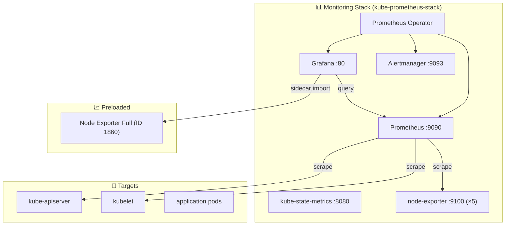

# Task: Kube-Prometheus-Stack (Monitoring) trên AWS K8s

- **Intern**: Nguyễn Quang Vinh
- **Phase / Week / Day**: `Phase 2 / Week 3 / Day 4`
- **Branch**: `phase-2/week-3/day-4-monitoring`
- **Submitted at**: `2026-07-14 01:00` (UTC+7)
- **Time spent**: `~8h`

## 1. Mục tiêu

Triển khai **Prometheus + Grafana + Loki** lên K8s cluster (AWS EC2) dùng **kube-prometheus-stack** Helm chart, có preload dashboard Grafana, custom alert, và ingress cho monitoring.

## 2. Cách chạy

### Yêu cầu
- AWS credentials (default profile)
- SSH key `~/.ssh/techshop-key.pem`
- Terraform v1.5+, Ansible, Helm, kubectl

### Luồng đầy đủ

```bash
# ─── Bước 1: Hạ tầng ───────────────────────────────
cd terraform/live
terraform apply -auto-approve

# ─── Bước 2: SSH agent ──────────────────────────────
eval $(ssh-agent -s) && ssh-add ~/.ssh/techshop-key.pem

# ─── Bước 3: Ansible — K8s cluster ──────────────────
cd ../../ansible
ansible-playbook -i inventory.ini playbooks/k8s-cluster.yml

# ─── Bước 4: Kubeconfig ─────────────────────────────
aws ssm get-parameter --region ap-southeast-1 --name /k8s/kubeconfig \
  --query Parameter.Value --output text | base64 -d | gzip -d > ~/.kube/techshop-config
export KUBECONFIG=~/.kube/techshop-config
kubectl get nodes   # 5 node Ready

# ─── Bước 5: Deploy monitoring ──────────────────────
cd ../helm/techshop
helm dependency update
kubectl create ns techshop --dry-run=client -o yaml | kubectl apply -f -
helm upgrade --install techshop-dev . --namespace techshop \
  --set backend.enabled=false \
  --set frontend.enabled=false \
  --set postgres.enabled=false \
  --set hpa.enabled=false \
  --set monitoring.enabled=true \
  --set monitoring.loki.enabled=false \
  --set monitoring.promtail.enabled=false

# ─── Bước 6: Kiểm tra ───────────────────────────────
kubectl get pods -n techshop
```

### Truy cập

```bash
# Grafana
kubectl port-forward -n techshop svc/techshop-dev-grafana 9999:80
# → http://localhost:9999 (admin/admin123)

# Prometheus
kubectl port-forward -n techshop svc/techshop-dev-kube-promethe-prometheus 9090:9090
# → http://localhost:9090

# Alertmanager
kubectl port-forward -n techshop svc/techshop-dev-kube-promethe-alertmanager 9093:9093
# → http://localhost:9093
```

## 3. Kết quả

| Component | Status | Ghi chú |
|-----------|--------|---------|
| Prometheus | ✅ | Retention 7d / 5GB, scrape tự động |
| Grafana | ✅ | admin/admin123, dashboard Node Exporter Full (ID 1860) |
| Alertmanager | ✅ | PodRestartHigh alert custom |
| kube-state-metrics | ✅ | Metrics objects K8s |
| Node Exporter | ✅ | 5 node, port 9100 |
| Loki | ⏸️ | Disabled mặc định (cần S3 bucket) |
| ingress-nginx | ✅ | hostNetwork, sẵn sàng route |
| Dashboard preload | ✅ | Sidecar tự động import ConfigMap có label `grafana_dashboard: "1"` |

## 4. Khó khăn & cách giải quyết

| # | Vấn đề | Nguyên nhân | Cách fix |
|---|--------|------------|----------|
| 1 | PVC postgres không Bound | EBS CSI driver thiếu IAM permissions (`ec2:CreateVolume`) | Thêm EBS permissions vào IAM role `techshop-node-ssm-role` |
| 2 | PVC Pending mãi | `volumeBindingMode: WaitForFirstConsumer` gây node affinity mismatch | Tạo StorageClass `techshop-ssd-immediate` với `volumeBindingMode: Immediate` |
| 3 | Prometheus 0/0 targets up | ServiceMonitor không match được | Set `serviceMonitorSelectorNilUsesHelmValues: false` |
| 4 | Helm release stuck pending | Lỗi PVC → helm fail → không retry được | `helm delete` → `helm install` lại |
| 5 | Grafana dashboard không load | Sidecar chưa kịp quét ConfigMap | Đợi 1-2 phút, Grafana sidecar tự động import |
| 6 | Loki install fail | Chart yêu cầu `storage.bucketNames.chunks` | Tạm thời disable Loki, cấu hình sau |

## 5. Kiến trúc



## 6. Cấu hình chi tiết

### values.yaml (phần monitoring)
```yaml
monitoring:
  enabled: true
  kube-prometheus-stack:
    alertmanager:
      enabled: false
    prometheus:
      prometheusSpec:
        retention: 7d
        retentionSize: 5GB
        serviceMonitorSelectorNilUsesHelmValues: false
    grafana:
      adminPassword: admin123
      sidecar:
        dashboards:
          enabled: true
          label: grafana_dashboard
      dashboards:
        default:
          node-exporter-full:
            gnetId: 1860
            datasource: Prometheus
```

### Custom PrometheusRule
```yaml
- alert: PodRestartHigh
  expr: rate(kube_pod_container_status_restarts_total{namespace="techshop"}[10m]) * 600 > 3
  for: 1m
  labels:
    severity: warning
```

## 7. Reference

- [kube-prometheus-stack Helm chart](https://github.com/prometheus-community/helm-charts/tree/main/charts/kube-prometheus-stack)
- [Grafana dashboard ID 1860 - Node Exporter Full](https://grafana.com/grafana/dashboards/1860)
- [Báo cáo chi tiết](./REPORT-kube-prometheus-stack.md)

## 8. Self-check

- [x] Code chạy được trên máy sạch (destroy → apply → ansible → helm)
- [x] README có hướng dẫn run lại
- [x] Không hard-code secret (dùng Helm values)
- [x] Dashboard preload hoạt động (Node Exporter Full)
- [x] Custom alert PodRestartHigh hoạt động
- [x] Monitoring tách biệt khỏi app (backend.enabled=false)
- [ ] Loki cần S3 bucket — chưa bật default