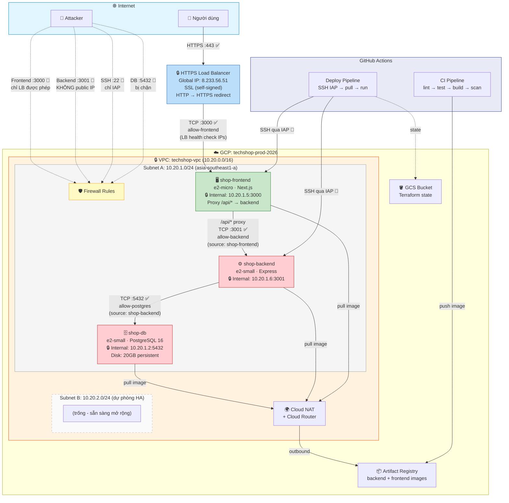

## Task: `Deploy to Google Cloud`

- **Intern**: `Nguyễn Quang Vinh`
- **Phase / Week / Day**: `Phase 1 / Week 3 / Day 3`
- **Branch**: `phase-1/week-3/day-3-deploy-to-google-cloud`
- **Submitted at**: `2026-07-05 17:00` (UTC+7)
- **Time spent**: `~10h`
- **Phase 2**: HTTPS Load Balancer (branch `phase-2/week-3/day-3-https-monitoring`)

## 1. Mục tiêu

Triển khai web (Next.js + Express + PostgreSQL) lên GCP với hạ tầng: VPC, HTTPS, CI/CD, bảo mật IAP, remote state.

## 2. Kiến trúc triển khai

### 2.1. Sơ đồ tổng quan



## 3. Cách chạy 

```bash
# 1. Clone repo
git clone https://github.com/vinh25042005/deploy-web.git
cd deploy-web

# 2. Sinh secret ngẫu nhiên
openssl rand -hex 64          # → JWT_SECRET
openssl rand -base64 24       # → DB_PASSWORD

# 3. Tạo file .env (đã gitignored)
cp .env.example .env
# → điền JWT_SECRET, DB_PASSWORD, DB_USER, DB_NAME

# 4. Tạo terraform.tfvars (đã gitignored)
cd terraform
cp terraform.tfvars.example terraform.tfvars
# → điền db_password, db_user, db_name

# 5. Bật IAP API + cấp quyền
gcloud services enable iap.googleapis.com
gcloud projects add-iam-policy-binding techshop-prod-2026 \
  --member="serviceAccount:terraform-sa@..." \
  --role="roles/iap.tunnelResourceAccessor"

# 6. Deploy hạ tầng lên GCP
terraform init
terraform apply

# 7. Thêm GitHub Secrets + Variables
# Repo → Settings → Secrets and variables → Actions
# Secrets:  JWT_SECRET, DB_USER, DB_PASSWORD, DB_NAME, GCP_SA_KEY
# Variables: GCP_PROJECT_ID, LB_IP, DB_INTERNAL_IP, BACKEND_INTERNAL_URL

# 8. SSH vào DB VM, khởi động postgres + đổi mật khẩu
gcloud compute ssh deploy@shop-db --zone=asia-southeast1-a --tunnel-through-iap
sudo systemctl start docker
sudo docker run -d --name postgres ... postgres:16-alpine
sudo docker exec postgres psql -U postgres -c "ALTER USER postgres PASSWORD '...'"

# 9. SSH vào backend VM, pull image + migrate + seed
gcloud compute ssh deploy@shop-backend --zone=asia-southeast1-a --tunnel-through-iap
sudo docker pull <registry>/backend:latest
sudo docker run -d --name backend ... <registry>/backend:latest
sudo docker exec backend npx prisma migrate deploy
sudo docker exec backend npx tsx database/seed.ts

# 10. SSH vào frontend VM, pull image
gcloud compute ssh deploy@shop-frontend --zone=asia-southeast1-a --tunnel-through-iap
sudo docker pull <registry>/frontend:latest
sudo docker run -d --name frontend ... <registry>/frontend:latest

# 11. Fix quyền docker cho CI
sudo usermod -aG docker deploy   # trên cả backend + frontend VM

# 12. Push code → CI tự build, test, scan → Deploy tự chạy
git push

# 13. Verify
curl -k https://8.233.56.51                    # HTTPS Load Balancer
curl -I http://8.233.56.51                     # HTTP → 301 redirect đến HTTPS
```

## 4. Kết quả

| Thành phần | Địa chỉ |
|-----------|---------|
| Website (HTTPS) | https://8.233.56.51 |
| HTTP redirect | http://8.233.56.51 → 301 → HTTPS |
| API (qua proxy) | https://8.233.56.51/api |
| Backend (internal) | 10.20.1.6:3001 (chỉ frontend + LB nối được) |
| Health Check | SSH backend → `curl localhost:3001/api/health` |
| Load Balancer IP | 8.233.56.51 |

## 5. Khó khăn & cách giải quyết

- **DB mất sau terraform apply** → Tách persistent disk riêng `shop-db-data`, mount `/data/postgres`
- **TypeScript build fail (JWT_SECRET string|undefined)** → Dùng `requireEnv()` throw error thay vì `process.exit()`
- **Docker permission denied trong CI** → `usermod -aG docker deploy` trong startup script
- **Artifact Registry auth trên VM** → Set IAM `allUsers: artifactregistry.reader`
- **Backend lộ public IP** → Next.js rewrites proxy `/api/*` → backend chỉ còn internal IP
- **Frontend lộ public IP, HTTP** → HTTPS Load Balancer + HTTP→HTTPS redirect → frontend internal-only, firewall chỉ LB
- **Backend IP thay đổi sau apply** → Dùng GitHub Variables, cập nhật sau mỗi lần apply

## 6. Self-check
- [x] Code chạy được trên máy sạch (`terraform apply` + CI tự deploy)
- [x] README có hướng dẫn run lại
- [x] Không hard-code secret (dùng GitHub Secrets + `.env` gitignored)
- [x] Commit message rõ ràng
- [x] Đã review lại code 1 lượt