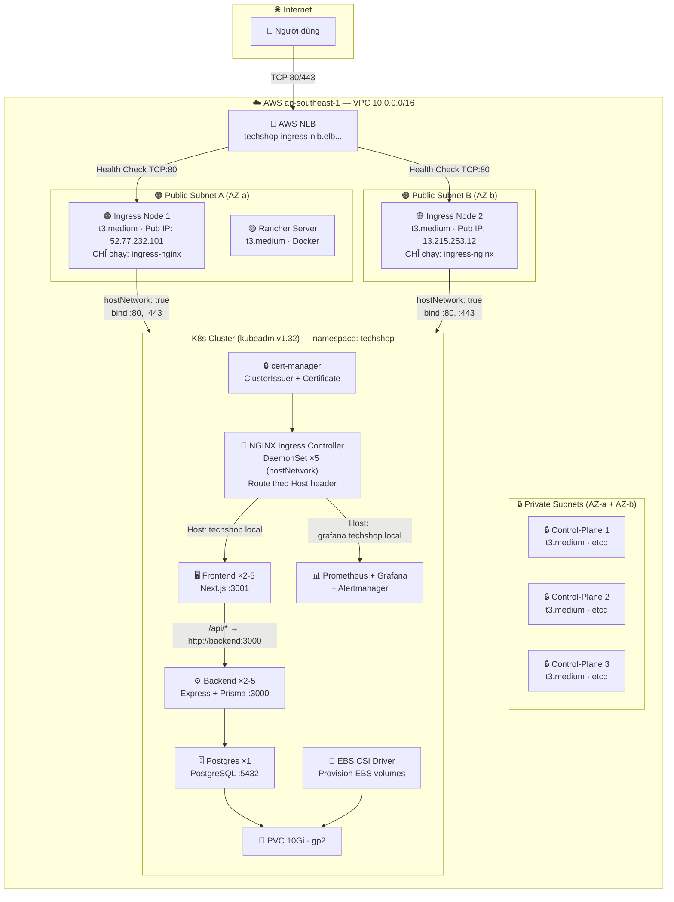
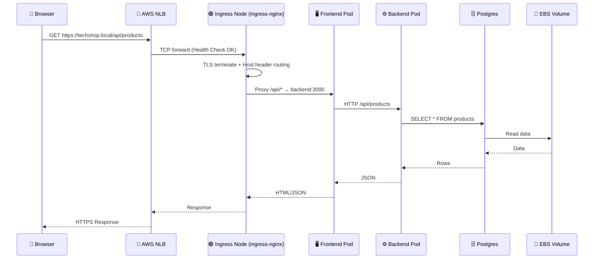
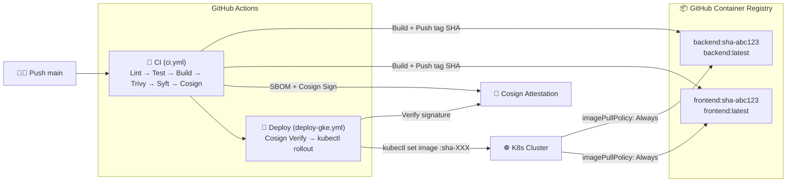
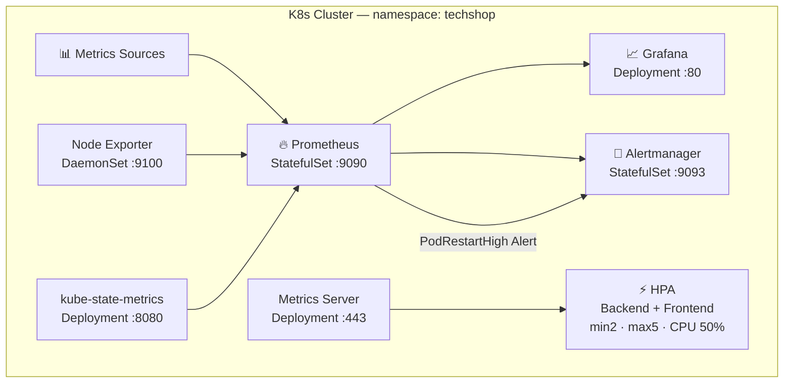
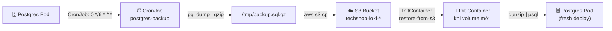

## 1. Kiến trúc tổng quan — Full Hạ tầng

### 1a. Sơ đồ hạ tầng AWS



> **Phân bố node:** 2 Ingress Node (Public Subnet) chỉ chạy ingress-nginx, nhận traffic từ NLB. 3 Control-Plane Node (Private Subnet) chạy TOÀN BỘ ứng dụng (backend, frontend, postgres, prometheus, grafana, cert-manager...). Ra internet qua NAT Gateway.

### 1b. Luồng request chi tiết



### 1c. CI/CD Pipeline



> **Dùng SHA tag thay vì latest:** Mỗi commit → 1 tag immutable `sha-<git hash>`. Deploy dùng SHA tag → không bị race condition khi 2 CI chạy gần nhau.

### 1d. Monitoring Stack



### 1e. Kiến trúc Node (Phân bổ Pod)

```
┌─────────────────────────────────────────────────────────────┐
│                    5 EC2 t3.medium                           │
│                                                              │
│  ┌──────────────────────┐  ┌──────────────────────────────┐ │
│  │  INGRESS NODES (2)   │  │  CONTROL-PLANE NODES (3)     │ │
│  │  Public Subnet        │  │  Private Subnet              │ │
│  │                       │  │                              │ │
│  │  ✅ ingress-nginx     │  │  ✅ backend ×2               │ │
│  │  ✅ ebs-csi-node      │  │  ✅ frontend ×3              │ │
│  │  ✅ node-exporter     │  │  ✅ postgres                 │ │
│  │                       │  │  ✅ prometheus               │ │
│  │  ❌ KHÔNG chạy app    │  │  ✅ grafana                  │ │
│  │     (taint: ingress)  │  │  ✅ alertmanager             │ │
│  │                       │  │  ✅ cert-manager             │ │
│  │  Nhận traffic từ NLB  │  │  ✅ etcd (3 replicas)        │ │
│  └──────────────────────┘  └──────────────────────────────┘ │
│                                                              │
│  ┌──────────────────────┐                                    │
│  │  RANCHER (1)         │                                    │
│  │  Public Subnet        │                                    │
│  │  Docker standalone    │                                    │
│  └──────────────────────┘                                    │
└─────────────────────────────────────────────────────────────┘
```

### 1f. Luồng Backup/Restore


---

## 2. Cấu trúc thư mục

```
deploy-web/
├── .github/workflows/
│   ├── ci.yml               # CI: Lint → Test → Build → Scan → SBOM → Sign
│   └── deploy-gke.yml       # CD: Verify signature → Deploy K8s
├── ansible/
│   ├── inventory.ini         # Tạo bởi Terraform (local_file)
│   ├── group_vars/all.yml    # k8s_version: "1.32", pod_cidr: "10.244.0.0/16"
│   ├── playbooks/k8s-cluster.yml
│   └── roles/
│       ├── common/tasks/   # containerd + kubeadm + kubectl + kubelet
│       ├── master/tasks/   # kubeadm init + Calico + upload SSM
│       └── worker/tasks/   # join cluster + label node
├── backend/
│   ├── Dockerfile           # Express + Prisma + TypeScript (multi-stage build)
│   ├── package.json
│   └── src/                 # controllers, middleware, services, routes
├── frontend/
│   ├── Dockerfile           # Next.js (multi-stage build)
│   ├── package.json
│   ├── next.config.js
│   └── src/app/api/[...path]/route.ts  # Proxy API → backend
├── database/
│   ├── seed.ts              # Dữ liệu mẫu
│   └── prisma/
│       ├── schema.prisma    # PostgreSQL schema
│       └── migrations/
├── helm/techshop/
│   ├── Chart.yaml           # 7 dependencies
│   ├── values.yaml          # Config mặc định
│   ├── env/                 # values-dev.yaml, values-stg.yaml, values-prd.yaml
│   └── templates/           # K8s manifests (xem bảng bên dưới)
├── terraform/
│   ├── live/
│   │   ├── main.tf          # Root module: network + compute + rancher
│   │   ├── variables.tf     # region, project_name, kubeconfig_path
│   │   └── outputs.tf       # ingress_public_ips, rancher_url
│   └── modules/
│       ├── network/         # VPC, 4 subnet, IGW, NAT, 3 SG
│       ├── compute/         # 5 EC2 + IAM + inventory.tpl
│       └── rancher/         # EC2 + Docker Rancher (user_data)
└── setup.sh                 # Tự động hóa toàn bộ
```

