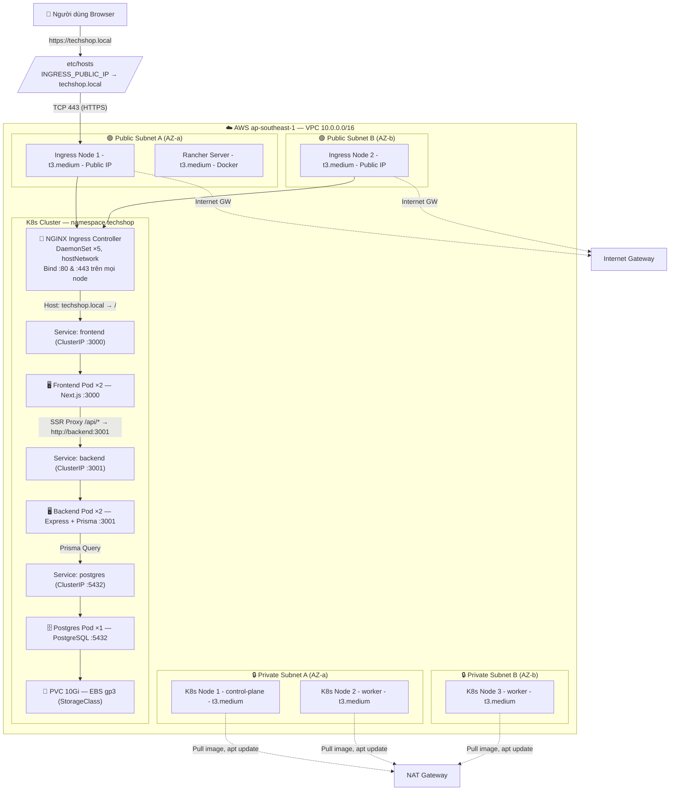
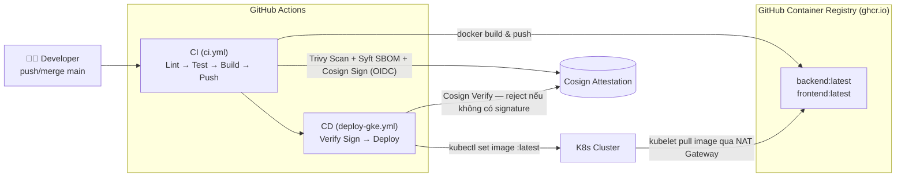
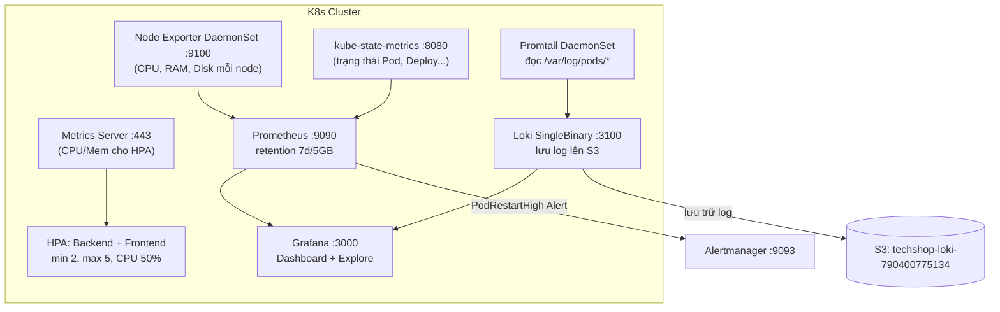

# TechShop — E-Commerce Platform on K8s

> **Báo cáo chi tiết CI/CD + Infrastructure + Deployment**


---

## Mục lục

1. [Kiến trúc tổng quan — Full Hạ tầng](#1-kiến-trúc-tổng-quan--full-hạ-tầng)
2. [Cấu trúc thư mục](#2-cấu-trúc-thư-mục)
3. [Bước 1: Terraform — Hạ tầng AWS](#3-bước-1-terraform--hạ-tầng-aws)
4. [Bước 2: Ansible — Cài K8s Cluster](#4-bước-2-ansible--cài-k8s-cluster)
5. [Bước 3: Helm — Deploy App + Monitoring](#5-bước-3-helm--deploy-app--monitoring)
6. [Bước 4: Database Migration + Seed](#6-bước-4-database-migration--seed)
7. [CI/CD Pipeline](#7-cicd-pipeline)
8. [Truy cập hệ thống](#8-truy-cập-hệ-thống)
9. [Flow Destroy & Deploy đầy đủ](#9-flow-destroy--deploy-đầy-đủ)

---

## 1. Kiến trúc tổng quan — Full Hạ tầng

### 1a. Luồng request từ Người dùng → Web



> **Phân bố subnet:** 3 node K8s (control-plane + worker) nằm trong **Private Subnet**, ra internet qua NAT Gateway. 2 Ingress node + Rancher nằm trong **Public Subnet**, có Public IP trực tiếp ra internet qua Internet Gateway.

### 1b. Luồng CI/CD & Pull Image



### 1c. Luồng Monitoring & Logging



### 1d. Sơ đồ tổng quan tài nguyên AWS

```
┌──────────────────────────────────────────────────────────────────┐
│                     AWS ap-southeast-1                            │
│  ┌─────────────────────────────────────────────────────────────┐ │
│  │ VPC 10.0.0.0/16                                             │ │
│  │                                                              │ │
│  │  ┌─────────────────────┐   ┌─────────────────────┐          │ │
│  │  │ PUBLIC SUBNET AZ-a  │   │ PUBLIC SUBNET AZ-b  │          │ │
│  │  │                     │   │                     │          │ │
│  │  │  🟢 Rancher EC2     │   │  🟢 Ingress Node 2  │          │ │
│  │  │  🟢 Ingress Node 1  │   │                     │          │ │
│  │  └─────────┬───────────┘   └──────────┬──────────┘          │ │
│  │            │ Internet GW               │ Internet GW         │ │
│  │            └──────────────┬────────────┘                     │ │
│  │                           │ NAT Gateway                      │ │
│  │  ┌─────────────────────┐  │  ┌─────────────────────┐        │ │
│  │  │ PRIVATE SUBNET AZ-a │  │  │ PRIVATE SUBNET AZ-b │        │ │
│  │  │                     │  │  │                     │        │ │
│  │  │  🔒 K8s Node 1      │  │  │  🔒 K8s Node 3      │        │ │
│  │  │     (control-plane) │  │  │     (worker)        │        │ │
│  │  │  🔒 K8s Node 2      │  │  │                     │        │ │
│  │  │     (worker)        │  │  │                     │        │ │
│  │  └─────────────────────┘  │  └─────────────────────┘        │ │
│  └─────────────────────────────────────────────────────────────┘ │
│                                                                   │
│  ┌──────────────┐  ┌──────────────┐  ┌─────────────────────┐     │
│  │ IAM Role     │  │ SSM Parameter│  │ S3 Buckets           │     │
│  │ SSM+EBS+S3  │  │ Store        │  │ • techshop-tfstate   │     │
│  │              │  │ /k8s/kubeconf│  │ • techshop-loki-... │     │
│  └──────────────┘  └──────────────┘  └─────────────────────┘     │
└──────────────────────────────────────────────────────────────────┘
```

### Chi tiết từng bước khi người dùng truy cập `https://techshop.local`:

| Bước | Thành phần | Hành động |
|------|-----------|----------|
| 1 | Browser | Gửi request HTTPS đến `techshop.local` |
| 2 | `/etc/hosts` | Phân giải → Public IP của Ingress Node |
| 3 | Internet Gateway | Route request vào VPC |
| 4 | Ingress Node EC2 | Nhận request tại port 443 (public subnet) |
| 5 | NGINX Ingress Controller | hostNetwork=true → listen trực tiếp port 443 của node |
| 6 | NGINX | Đọc Ingress rule: `Host: techshop.local` → route đến Service `frontend:3000` |
| 7 | Service frontend (ClusterIP) | Load-balance đến 1 trong 2 Frontend Pod |
| 8 | Frontend Pod (Next.js) | Nếu request `/api/*` → proxy qua `http://backend:3001` |
| 9 | Service backend (ClusterIP) | Load-balance đến 1 trong 2 Backend Pod |
| 10 | Backend Pod (Express) | Query PostgreSQL qua Service `postgres:5432` |
| 11 | Postgres Pod | Đọc/ghi dữ liệu từ PVC (EBS gp3 10Gi) |
| 12 | Response | Đi ngược lại: Postgres → Backend → Frontend → NGINX → Browser |
---

## 2. Cấu trúc thư mục

```
deploy-web/
├── .github/workflows/
│   ├── ci.yml               # CI: Lint → Test → Build → Scan → SBOM → Sign
│   └── deploy-gke.yml       # CD: Verify signature → Deploy K8s
├── ansible/
│   ├── inventory.ini         # Tạo bởi Terraform (local_file)
│   ├── group_vars/all.yml    # k8s_version: "1.32", pod_cidr: "10.244.0.0/16"
│   ├── playbooks/k8s-cluster.yml
│   └── roles/
│       ├── common/tasks/   # containerd + kubeadm + kubectl + kubelet
│       ├── master/tasks/   # kubeadm init + Calico + upload SSM
│       └── worker/tasks/   # join cluster + label node
├── backend/
│   ├── Dockerfile           # Express + Prisma + TypeScript (multi-stage build)
│   ├── package.json
│   └── src/                 # controllers, middleware, services, routes
├── frontend/
│   ├── Dockerfile           # Next.js (multi-stage build)
│   ├── package.json
│   ├── next.config.js
│   └── src/app/api/[...path]/route.ts  # Proxy API → backend
├── database/
│   ├── seed.ts              # Dữ liệu mẫu
│   └── prisma/
│       ├── schema.prisma    # PostgreSQL schema
│       └── migrations/
├── helm/techshop/
│   ├── Chart.yaml           # 7 dependencies
│   ├── values.yaml          # Config mặc định
│   ├── env/                 # values-dev.yaml, values-stg.yaml, values-prd.yaml
│   └── templates/           # K8s manifests (xem bảng bên dưới)
├── terraform/
│   ├── live/
│   │   ├── main.tf          # Root module: network + compute + rancher
│   │   ├── variables.tf     # region, project_name, kubeconfig_path
│   │   └── outputs.tf       # ingress_public_ips, rancher_url
│   └── modules/
│       ├── network/         # VPC, 4 subnet, IGW, NAT, 3 SG
│       ├── compute/         # 5 EC2 + IAM + inventory.tpl
│       └── rancher/         # EC2 + Docker Rancher (user_data)
└── setup.sh                 # Tự động hóa toàn bộ
```

---

## 3. Bước 1: Terraform — Hạ tầng AWS

```bash
cd ~/deploy-web/terraform/live
terraform init
terraform apply -auto-approve
```

### `terraform init` — Khởi tạo
- **File được gọi:** `terraform/live/main.tf` (dòng 1-15)
- **Làm gì:** Tải provider `hashicorp/aws ~> 5.0`, kết nối S3 backend `techshop-tfstate` để lưu state từ xa
- **State backend:** S3 bucket `techshop-tfstate` (tạo thủ công 1 lần bằng AWS CLI). State không lưu local → tránh mất khi xóa máy

### `terraform apply -auto-approve` — Tạo hạ tầng

Gọi `terraform/live/main.tf` — tạo resource theo thứ tự:

#### 3a. Module Network
**File:** `terraform/modules/network/main.tf`

| Resource | Giải thích |
|----------|-----------|
| `aws_vpc` | VPC `10.0.0.0/16`, bật DNS |
| `aws_subnet` × 4 | public-a, public-b, private-a, private-b — mỗi cái 1 AZ |
| `aws_internet_gateway` | Cho public subnet ra internet |
| `aws_eip` + `aws_nat_gateway` | Cho private subnet ra internet qua NAT |
| `aws_route_table` × 2 | public route (IGW) + private route (NAT) |
| `aws_security_group` × 3 | internal (nội bộ VPC), ingress (80/443), https |

**Kết quả:** VPC + 4 subnet (2 AZ) + IGW + NAT + 3 SG

#### 3b. Module Compute
**File:** `terraform/modules/compute/main.tf`

| Resource | Giải thích |
|----------|-----------|
| `data.aws_ami` | Ubuntu 22.04 mới nhất từ Canonical |
| `aws_iam_role` + `aws_iam_instance_profile` | IAM role cho SSM + EBS + S3 |
| `aws_iam_role_policy` | Inline policy: `ssm:*`, `ec2:*Volume*`, `s3:*` (bucket techshop-loki) |
| `aws_instance` × 3 (node) | `t3.medium`, private subnet, K8s node |
| `aws_instance` × 2 (ingress) | `t3.medium`, public subnet, ingress node |
| `local_file` | Tạo `ansible/inventory.ini` từ template `inventory.tpl` |

**IAM Policy chi tiết (`terraform/modules/compute/main.tf` dòng 37-66):**
- `ssm:PutParameter`, `ssm:GetParameter` — upload/download kubeconfig
- `ec2:CreateVolume`, `ec2:DeleteVolume`, `ec2:DescribeVolumes` — EBS volumes cho PVC
- `s3:ListBucket`, `s3:GetObject`, `s3:PutObject` — backup Postgres + Loki S3

**Kết quả:** 5 EC2 + IAM role + `ansible/inventory.ini`

#### 3c. Module Rancher
**File:** `terraform/modules/rancher/main.tf` + `rancher-init.sh`

| Resource | Giải thích |
|----------|-----------|
| `aws_instance` | EC2 `t3.medium`, public subnet A |
| `aws_security_group` | Mở port 22 (SSH), 80 (HTTP), 443 (HTTPS) |
| `user_data` | Chạy script `rancher-init.sh` khi boot |

**rancher-init.sh** — chạy tự động khi EC2 boot:
1. `curl -fsSL https://get.docker.com | sh` — Cài Docker
2. `docker run -d --name rancher -p 80:80 -p 443:443 rancher/rancher:v2.9.2` — Chạy Rancher
3. Poll `https://localhost/ping` → đợi Rancher sẵn sàng (timeout 600s)

**Kết quả:** EC2 Rancher tự động cài Docker + Rancher (~5 phút sau khi EC2 boot)

### Outputs sau Terraform

| Output | Ý nghĩa |
|--------|---------|
| `ingress_public_ips` | 2 IP public của ingress node (dùng để truy cập web) |
| `rancher_url` | `https://<RANCHER_IP>` |
| `monitoring_grafana` | Hướng dẫn port-forward Grafana |

### Còn thiếu gì sau Terraform?
- ❌ Chưa có K8s cluster (EC2 để trống, chưa cài gì)
- ❌ Chưa có kubeconfig
- ❌ Chưa có app/monitoring

---

## 4. Bước 2: Ansible — Cài K8s Cluster

```bash
eval $(ssh-agent -s) && ssh-add ~/.ssh/techshop-key.pem
cd ~/deploy-web/ansible
ansible-playbook -i inventory.ini playbooks/k8s-cluster.yml
```

### `eval $(ssh-agent -s) && ssh-add`
- **Làm gì:** Khởi động SSH agent, nạp private key vào RAM
- **Tại sao cần:** Worker node trong private subnet không có public IP. Ansible SSH vào worker qua master node (ProxyJump). Key được forward qua `ForwardAgent=yes` — không cần copy key lên master

### Playbook (`ansible/playbooks/k8s-cluster.yml`)
Gồm 4 play, chạy tuần tự:

#### Play 1: Role `common` — Cài công cụ K8s trên tất cả node
**File:** `ansible/roles/common/tasks/main.yml`

| # | Task | Giải thích |
|---|------|-----------|
| 1 | Replace apt mirror | Đổi mirror từ `ec2.archive.ubuntu.com` → `archive.ubuntu.com` (tránh lỗi 503) |
| 2 | Disable swap | `swapoff -a`, xóa swap khỏi `/etc/fstab` — K8s bắt buộc |
| 3-4 | Kernel modules | Load `overlay`, `br_netfilter` cho containerd networking |
| 5-6 | sysctl | `net.bridge.bridge-nf-call-iptables=1`, `net.ipv4.ip_forward=1` |
| 7 | Install containerd | `apt install containerd` |
| 8 | Configure containerd | Bật `SystemdCgroup` trong config containerd |
| 9 | Ensure containerd running | `systemctl enable --now containerd` |
| 10-13 | Install K8s tools | Thêm Kubernetes apt repo → cài `kubeadm`, `kubectl`, `kubelet`, `awscli` |

#### Play 2: Role `master` — Khởi tạo cluster
**File:** `ansible/roles/master/tasks/main.yml`

| # | Task | Giải thích |
|---|------|-----------|
| 1-2 | Get IP | Lấy private IP + public IP từ EC2 metadata (`169.254.169.254`) |
| 3 | Get AWS region | Từ metadata |
| 4 | Clean old SSM params | Xóa join-command, kubeconfig cũ khỏi Parameter Store |
| 5 | **kubeadm init** | `--control-plane-endpoint=<PRIVATE_IP>:6443 --pod-network-cidr=10.244.0.0/16 --upload-certs --kubernetes-version=v1.32.0` |
| 6-7 | Setup kubeconfig | Copy `admin.conf` → `~/.kube/config`, patch IP private → public |
| 8 | Calico CNI | `kubectl apply -f calico.yaml` v3.28.0 |
| 9 | Untaint master | `kubectl taint nodes --all node-role.kubernetes.io/control-plane-` |
| 10 | Wait Calico | Đợi tất cả Calico pod Ready (timeout 120s) |
| 11-12 | Join tokens | Tạo `kubeadm token` cho control-plane và worker join |
| 13 | Upload SSM | Lưu join commands + kubeconfig (gzip+base64) lên Parameter Store |

**Chi tiết `kubeadm init`:**
- `--control-plane-endpoint`: Địa chỉ để các node khác join vào cluster
- `--apiserver-advertise-address`: IP private của master
- `--apiserver-cert-extra-sans`: Thêm public IP vào TLS certificate (cho phép truy cập từ xa)
- `--pod-network-cidr=10.244.0.0/16`: Dải IP cho Calico pod network
- `--upload-certs`: Tự động upload certificate để node khác có thể join làm control-plane
- `--kubernetes-version=v1.32.0`: Phiên bản K8s (từ `group_vars/all.yml`)

#### Play 3-4: Role `worker` — Join các node còn lại
**File:** `ansible/roles/worker/tasks/main.yml`

| # | Task | Giải thích |
|---|------|-----------|
| 1-2 | Wait SSM | Poll Parameter Store, đợi master upload join-command (timeout 300s) |
| 3 | Join cluster | Chạy `kubeadm join` với command từ SSM |
| 4 | Label node | `kubectl label node <name> role=ingress` cho ingress node |

### Sau Ansible có gì?
- ✅ 5 node K8s (3 control-plane + 2 worker/ingress), tất cả Ready
- ✅ Calico CNI hoạt động (pod-to-pod networking)
- ✅ kubeconfig + join commands đã upload lên SSM Parameter Store

---

## 5. Bước 3: Helm — Deploy App + Monitoring

```bash
aws ssm get-parameter --region ap-southeast-1 --name /k8s/kubeconfig \
  --query Parameter.Value --output text | base64 -d | gzip -d > ~/.kube/techshop-config
export KUBECONFIG=~/.kube/techshop-config
kubectl get nodes

cd ~/deploy-web/helm/techshop
helm dependency update
helm upgrade --install techshop-dev . \
  --namespace techshop --create-namespace
```

### Lấy kubeconfig từ SSM
- **Làm gì:** Lấy kubeconfig (đã được master upload ở bước Ansible) từ SSM → giải nén gzip+base64 → lưu vào `~/.kube/techshop-config`
- **Tại sao:** Không cần SSH vào master để copy kubeconfig thủ công

### `helm dependency update`
**File:** `helm/techshop/Chart.yaml` — tải 6 chart dependency:

| Dependency | Version | Repository | Bật/tắt bởi |
|-----------|---------|-----------|-------------|
| kube-prometheus-stack | ~68 | prometheus-community | `monitoring.enabled: true` |
| loki | ~6 | grafana | `monitoring.loki.enabled: true` |
| promtail | ~6 | grafana | `monitoring.promtail.enabled: true` |
| ingress-nginx | ~4.11 | kubernetes | Luôn bật |
| aws-ebs-csi-driver | ~2.37 | kubernetes-sigs | `storage.ebsCSI.enabled: true` |
| metrics-server | ~3.12 | kubernetes-sigs | `hpa.enabled: true` |
| cert-manager | ~1.15 | jetstack | `ingress.tls.enabled: true` |

### `helm upgrade --install techshop-dev`
Helm đọc toàn bộ file trong `helm/techshop/templates/`, render với giá trị từ `values.yaml`, tạo K8s resources:

#### App Templates

| Template | Resource tạo | Chi tiết |
|----------|-------------|---------|
| `backend.yaml` | Deployment + Service | Express :3001, 2 replicas, image từ GHCR |
| `frontend.yaml` | Deployment + Service | Next.js :3000, 2 replicas, image từ GHCR |
| `postgres.yaml` | Deployment + Service + InitContainer | PostgreSQL :5432, PVC 10Gi, init container restore từ S3 |
| `postgres-pvc.yaml` | PersistentVolumeClaim | PVC 10Gi, RWO, StorageClass `techshop-ssd-immediate` |

#### Infrastructure Templates

| Template | Resource tạo | Chi tiết |
|----------|-------------|---------|
| `postgres-backup.yaml` | CronJob | Backup `pg_dump \| gzip \| aws s3 cp` mỗi 6h lên S3 |
| `storageclass.yaml` | StorageClass | `techshop-ssd-immediate`, EBS gp3, default StorageClass |
| `networkpolicy.yaml` | NetworkPolicy | Chỉ cho phép pod `app=backend` truy cập pod `app=postgres` |
| `rbac.yaml` | ServiceAccount + Role + RoleBinding | User `readonly` chỉ có quyền get/list/watch |
| `hpa.yaml` | HorizontalPodAutoscaler × 2 | Backend + Frontend: min 2, max 5 replicas, target CPU 50% |

#### Ingress Templates

| Template | Resource tạo | Chi tiết |
|----------|-------------|---------|
| `ingress.yaml` | Ingress | Route `techshop.local` → Service `frontend:3000`, TLS với secret `techshop-tls` |
| `grafana-ingress.yaml` | Ingress | Route `grafana.techshop.local` → Service `grafana:80` |

#### Config & Secret Templates

| Template | Resource tạo | Chi tiết |
|----------|-------------|---------|
| `configmap.yaml` | ConfigMap × 2 | `backend-config` (FRONTEND_URL, JWT_EXPIRES_IN) + `frontend-config` (BACKEND_INTERNAL_URL) |
| `secret.yaml` | Secret | `backend-secrets` (DATABASE_URL, JWT_SECRET) |

#### Monitoring Templates

| Template | Resource tạo | Chi tiết |
|----------|-------------|---------|
| `prometheus-rule.yaml` | PrometheusRule | Alert `PodRestartHigh`: pod restart > 3 lần / 10 phút |
| `grafana-datasource-loki.yaml` | Secret | Loki datasource cho Grafana (label `grafana_datasource: "1"`) |
| `cert-manager.yaml` | ClusterIssuer + Certificate | Tự động sinh & renew TLS certificate (selfsigned, 90 ngày) |

### Config chính trong `values.yaml`

```yaml
images:
  backend: ghcr.io/vinh25042005/deploy-web/backend:latest
  frontend: ghcr.io/vinh25042005/deploy-web/frontend:latest
  postgres: postgres:16-alpine

ingress-nginx:
  controller:
    hostNetwork: true        # Dùng host network → bind port 80/443 trực tiếp
    kind: DaemonSet          # Chạy trên TẤT CẢ node (cả ingress node có public IP)
    daemonset:
      useHostPort: true

postgres:
  backup:
    enabled: true            # CronJob backup S3 mỗi 6h
    s3Bucket: techshop-loki-790400775134

monitoring:
  loki:
    enabled: true            # Log aggregation
    deploymentMode: SingleBinary  # 1 pod thay vì 12 pod (scalable mode)
  promtail:
    enabled: true            # Log collector (DaemonSet)

hpa:
  enabled: true              # Auto-scale backend + frontend
  minReplicas: 2
  maxReplicas: 5
  targetCPU: 50
```

### Tổng số pod sau khi Helm deploy:

| Nhóm | Thành phần | Số pod |
|------|-----------|--------|
| App | Backend, Frontend, Postgres | 5 |
| Ingress | NGINX Ingress Controller | 5 (DaemonSet) |
| Storage | EBS CSI Controller + Node | 7 (2 controller + 5 node) |
| Monitoring | Prometheus, Grafana, Alertmanager, Node Exporter, kube-state-metrics | 9 |
| Logging | Loki SingleBinary, Promtail | 6 (1 Loki + 5 Promtail) |
| Metrics | Metrics Server | 1 |
| **Tổng** | | **~33 pods** |

---

## 6. Bước 4: Database Migration + Seed

```bash
kubectl exec -n techshop deploy/backend -- npx prisma migrate deploy --schema=database/prisma/schema.prisma
kubectl exec -n techshop deploy/backend -- npx tsx database/seed.ts
```

### Prisma Migrate
- **Làm gì:** Chạy migration SQL từ `database/prisma/migrations/20260702025119_init/` lên PostgreSQL
- **Tạo bảng:** `users`, `products`, `categories`, `cart_items`, `orders`, `order_items`
- **Schema path fix:** Trong container Docker, schema ở `/app/database/prisma/schema.prisma`. `backend/Dockerfile` dòng 37: `sed -i 's|"../database/prisma|"database/prisma|g' package.json` sửa path từ `../database/` → `database/` cho khớp với cấu trúc thư mục trong container

### Database Seed
- **Làm gì:** Chèn dữ liệu mẫu từ `database/seed.ts`
- **Dữ liệu tạo:** 2 user + 4 danh mục + 8 sản phẩm
- **Credentials mặc định:**
  - Admin: `admin@shop.com` / `admin123`
  - Customer: `customer@shop.com` / `customer123`

### Backup S3 tự động
CronJob `postgres-backup` chạy mỗi 6 giờ:
1. `pg_dump -U postgres shopdb` → dump toàn bộ database
2. `gzip` → nén
3. `aws s3 cp` → upload lên `s3://techshop-loki-790400775134/`

Khi destroy + deploy lại, InitContainer trong `postgres.yaml` kiểm tra PVC có trống không:
- Nếu trống → tìm backup mới nhất trên S3 → `gunzip | psql` → restore
- Nếu có data → skip restore

---

## 7. CI/CD Pipeline (GitHub Actions)

### CI Workflow (`ci.yml`)
**File:** `.github/workflows/ci.yml`

**Trigger:** push lên `main`, `develop` hoặc pull request.

**Permissions:**
```yaml
permissions:
  contents: read
  packages: write         # Push image lên GHCR
  id-token: write         # Cosign keyless signing (OIDC)
  security-events: write  # Upload Trivy SARIF
  attestations: write     # SBOM attestation
```

**Pipeline:**
```
┌─────────────────────────────────────────────────────────┐
│ 1. Lint (Node 20, 22 × ubuntu 22.04, 24.04)            │
│    backend: eslint | frontend: eslint                   │
├─────────────────────────────────────────────────────────┤
│ 2. Test                                                │
│    backend: jest | frontend: tsc --noEmit (type-check) │
├─────────────────────────────────────────────────────────┤
│ 3. Build & Push (chỉ trên push main)                   │
│    docker/build-push-action × 2 → GHCR                 │
│    ghcr.io/vinh25042005/deploy-web/backend:latest       │
│    ghcr.io/vinh25042005/deploy-web/frontend:latest      │
├─────────────────────────────────────────────────────────┤
│ 4. Trivy Scan                                          │
│    aquasecurity/trivy-action, severity: CRITICAL,HIGH  │
│    format: sarif → upload lên GitHub Security tab      │
│    exit-code: 0 (không fail build)                     │
├─────────────────────────────────────────────────────────┤
│ 5. Syft SBOM                                           │
│    anchore/sbom-action, format: spdx-json              │
│    upload artifact: sbom-backend, sbom-frontend        │
├─────────────────────────────────────────────────────────┤
│ 6. Cosign Sign (keyless OIDC)                          │
│    sigstore/cosign-installer                           │
│    cosign sign + cosign verify                         │
│    Dùng GitHub OIDC token (không cần private key)      │
└─────────────────────────────────────────────────────────┘
```

### CD Workflow (`deploy-gke.yml`)
**File:** `.github/workflows/deploy-gke.yml`

**Trigger:** CI thành công trên `main` (workflow_run).

**Pipeline:**
```
┌─────────────────────────────────────────────────────────┐
│ Job 1: verify-signatures (cosign verify)               │
│   Chạy trước deploy                                    │
│   Nếu image KHÔNG có signature → exit 1 (REJECT)       │
│   Certificate identity: GitHub Actions workflow path   │
│   OIDC issuer: https://token.actions.githubusercontent.com │
├─────────────────────────────────────────────────────────┤
│ Job 2: deploy-k8s (chỉ chạy nếu verify OK)             │
│   1. Lấy kubeconfig từ AWS SSM Parameter Store         │
│      aws ssm get-parameter --name /k8s/kubeconfig      │
│   2. kubectl set image deploy/backend → :latest        │
│   3. kubectl rollout status deploy/backend             │
│   4. kubectl set image deploy/frontend → :latest       │
│   5. kubectl rollout status deploy/frontend            │
└─────────────────────────────────────────────────────────┘
```

### GitHub Secrets cần thiết

| Secret | Dùng cho |
|--------|----------|
| `AWS_ACCESS_KEY_ID` | CD: lấy kubeconfig từ SSM Parameter Store |
| `AWS_SECRET_ACCESS_KEY` | CD: lấy kubeconfig từ SSM Parameter Store |

---

## 8. Truy cập hệ thống

| Dịch vụ | URL | Login |
|---------|-----|-------|
| **Web App** | `https://techshop.local` | `admin@shop.com` / `admin123` |
| **Rancher** | `https://<RANCHER_IP>` (từ `terraform output rancher_url`) | `admin` / `admin` |
| **Grafana** | `https://grafana.techshop.local` | `admin` / `prom-operator` |
| **Prometheus** | `kubectl port-forward -n techshop svc/techshop-dev-kube-promethe-prometheus 9090:9090` | — |

**⚠️ Cần cập nhật `/etc/hosts` sau mỗi lần destroy + deploy (IP thay đổi):**
```
<INGRESS_PUBLIC_IP> techshop.local grafana.techshop.local
```
Lấy IP mới: `cd ~/deploy-web/terraform/live && terraform output ingress_public_ips`

---

## 9. Flow Destroy & Deploy đầy đủ

```bash
# ═══════════════════════════════════════════════════════════
#  DESTROY
# ═══════════════════════════════════════════════════════════
cd ~/deploy-web/terraform/live
terraform destroy -auto-approve
# → Xóa tất cả EC2, VPC, SG... (RDS nếu có thì giữ lại)

# ═══════════════════════════════════════════════════════════
#  DEPLOY LẠI TOÀN BỘ
# ═══════════════════════════════════════════════════════════

# 1. Terraform — Tạo hạ tầng AWS
cd ~/deploy-web/terraform/live
terraform init && terraform apply -auto-approve
# → Output: ingress_public_ips, rancher_url
# → Có: VPC, EC2, IAM, inventory.ini
# → Chưa có: K8s cluster, app

# 2. SSH Agent + Ansible — Cài K8s cluster
eval $(ssh-agent -s) && ssh-add ~/.ssh/techshop-key.pem
cd ~/deploy-web/ansible
ansible-playbook -i inventory.ini playbooks/k8s-cluster.yml
# → Có: 5 node K8s Ready, Calico CNI
# → Chưa có: app, monitoring

# 3. Kubeconfig — Lấy từ SSM
aws ssm get-parameter --region ap-southeast-1 --name /k8s/kubeconfig \
  --query Parameter.Value --output text | base64 -d | gzip -d > ~/.kube/techshop-config
export KUBECONFIG=~/.kube/techshop-config
kubectl get nodes  # kiểm tra 5 node Ready

# 4. Helm — Deploy app + monitoring + storage + ingress
cd ~/deploy-web/helm/techshop
helm dependency update
helm upgrade --install techshop-dev . \
  --namespace techshop --create-namespace
# → ~33 pods chạy (app + monitoring + infra)
# → Chưa có: data trong database

# 5. Database — Migration + Seed
kubectl exec -n techshop deploy/backend -- npx prisma migrate deploy --schema=database/prisma/schema.prisma
kubectl exec -n techshop deploy/backend -- npx tsx database/seed.ts
# → Database có bảng + dữ liệu mẫu

# 6. Kiểm tra
kubectl get pods -n techshop
cd ~/deploy-web/terraform/live && terraform output

# 7. Cập nhật /etc/hosts (IP thay đổi sau destroy)
INGRESS_IP=$(cd ~/deploy-web/terraform/live && terraform output -raw ingress_public_ips | head -1 | tr -d '[]," ')
sudo sed -i '/techshop.local/d' /etc/hosts
echo "$INGRESS_IP techshop.local grafana.techshop.local" | sudo tee -a /etc/hosts

# 8. Truy cập
# Web:       https://techshop.local
# Grafana:   https://grafana.techshop.local
# Rancher:   https://<RANCHER_IP>
```
