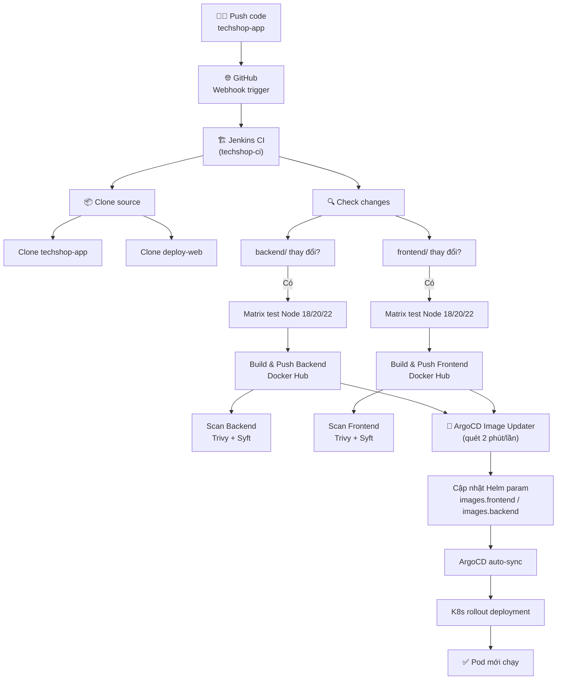

# Báo cáo luồng CI/CD — Push code → Deploy tự động

> **Dự án**: TechShop (monorepo `techshop-app` + GitOps `deploy-web`)
> **Ngày**: 2026-07-26

---

## Sơ đồ tổng quan



---

## Chi tiết từng bước

### Bước 1: Push code lên GitHub

Developer push code lên branch `techshop-app` của repo `vinh25042005/techshop-app`.

Cấu trúc monorepo:

```
techshop-app/
├── backend/          # Express.js + TypeScript
│   ├── Dockerfile
│   ├── package.json  # scripts: build, test, lint
│   └── src/
├── frontend/         # Next.js + TypeScript + Tailwind
│   ├── Dockerfile
│   ├── package.json  # scripts: build, start, dev
│   └── src/
└── database/         # Prisma schema + seed
```

---

### Bước 2: GitHub gửi Webhook → Jenkins

**Jenkinsfile** — dòng 4-6:
```groovy
triggers {
    pollSCM('* * * * *')        // Poll mỗi phút (dự phòng)
    githubPush()                 // Webhook trigger từ GitHub
}
```

- GitHub gửi webhook đến Jenkins server (cổng `9090`).
- Jenkins clone repo `deploy-web`, đọc `Jenkinsfile` từ Git.
- Pipeline `techshop-ci` bắt đầu chạy.

---

### Bước 3: Clone source code

**Jenkinsfile** — stage `Init`, dòng 28-44:

```groovy
stage('Init') {
    parallel {
        stage('Clone App Source') {          // Clone techshop-app (code cần build)
            steps {
                dir('app-source') {
                    git branch: "${APP_BRANCH}",
                        url: "${APP_REPO}",
                        credentialsId: 'github-token'
                }
            }
        }
        stage('Clone Deploy Repo') {         // Clone deploy-web (Jenkinsfile + Helm)
            steps {
                dir('deploy-web') {
                    checkout scm
                }
            }
        }
    }
}
```

- `APP_REPO` = `https://github.com/vinh25042005/techshop-app.git`
- `APP_BRANCH` = `techshop-app` (mặc định)
- Clone song song cả 2 repo vào workspace.

---

### Bước 4: Xác định thành phần cần build (smart build)

**Jenkinsfile** — stage `Check changes`, dòng 47-70:

```groovy
stage('Check changes') {
    steps {
        dir('app-source') {
            script {
                def changed = sh(
                    script: 'git diff --name-only HEAD~1 2>/dev/null || echo "first-build"',
                    returnStdout: true
                ).trim()
                if (changed == 'first-build') {
                    env.BUILD_BACKEND = 'true'
                    env.BUILD_FRONTEND = 'true'
                    echo "First build → build all"
                } else {
                    env.BUILD_BACKEND = changed.contains('backend/') ? 'true' : 'false'
                    env.BUILD_FRONTEND = changed.contains('frontend/') ? 'true' : 'false'
                    echo "Changed files: ${changed.split('\n').join(', ')}"
                }
            }
        }
    }
}
```

**Cách hoạt động**:
1. `git diff --name-only HEAD~1` → lấy danh sách file thay đổi so với commit trước.
2. Nếu là lần build đầu tiên (không có commit trước) → build cả 2.
3. Nếu danh sách chứa `backend/` → bật `BUILD_BACKEND`.
4. Nếu danh sách chứa `frontend/` → bật `BUILD_FRONTEND`.
5. Các stage sau dùng `when { expression { env.BUILD_BACKEND != 'false' } }` để quyết định chạy hay skip.

---

### Bước 5: Matrix test (Lint & Test) — Node 18, 20, 22

**Jenkinsfile** — stage `Lint & Test`, dòng 72-113:

```groovy
stage('Lint & Test') {
    when { expression { !params.SKIP_BUILD && (env.BUILD_BACKEND != 'false' || env.BUILD_FRONTEND != 'false') } }
    matrix {
        axes {
            axis {
                name 'NODE_VERSION'
                values '18', '20', '22'
            }
        }
        stages {
            stage('Backend (Node $NODE_VERSION)') {
                steps {
                    sh """
                        rm -rf app-source-backend-${NODE_VERSION}
                        cp -r app-source/backend app-source-backend-${NODE_VERSION}
                    """
                    dir("app-source-backend-${NODE_VERSION}") {
                        sh """#!/bin/bash
                            if [ "${NODE_VERSION}" != "22" ]; then
                                export NVM_DIR=/var/jenkins_home/.nvm
                                [ -s "\$NVM_DIR/nvm.sh" ] && . "\$NVM_DIR/nvm.sh"
                                nvm use ${NODE_VERSION}
                            fi
                            npm ci
                            npm run lint 2>/dev/null || true
                            npm test 2>/dev/null || true
                        """
                    }
                }
            }
            stage('Frontend (Node $NODE_VERSION)') {
                ...tương tự...
            }
        }
    }
}
```

**Chi tiết**:
- Matrix chạy song song trên 3 Node version: 18, 20, 22.
- `#!/bin/bash` — bắt buộc vì `nvm` là bash function, không chạy dưới dash.
- `if [ "${NODE_VERSION}" != "22" ]` — Node 22 là system default trong container, không cần nvm.
- `npm ci` — clean install từ `package-lock.json`.
- `npm run lint 2>/dev/null || true` — lint, lỗi không block pipeline.
- `npm test 2>/dev/null || true` — test, lỗi không block pipeline.
- Mỗi Node version copy riêng 1 folder `app-source-backend-{NODE_VERSION}` để tránh xung đột node_modules.

---

### Bước 6: Build & Push Docker image

**Jenkinsfile** — stage `Build & Push Backend`, dòng 115-138:

```groovy
stage('Build & Push Backend') {
    when { expression { !params.SKIP_BUILD && !params.SKIP_BACKEND && env.BUILD_BACKEND != 'false' } }
    steps {
        dir('app-source') {
            withCredentials([usernamePassword(
                credentialsId: 'dockerhub-credentials',
                usernameVariable: 'DOCKER_USER',
                passwordVariable: 'DOCKER_PAT')
            ]) {
                sh """
                    echo \$DOCKER_PAT | docker login -u \$DOCKER_USER --password-stdin
                    docker build -f backend/Dockerfile \\
                        -t ${REGISTRY_BASE}/deploy-web-backend:${IMAGE_TAG} \
                        -t ${REGISTRY_BASE}/deploy-web-backend:${params.ENV} \
                        .
                    docker push ${REGISTRY_BASE}/deploy-web-backend:${IMAGE_TAG}
                    docker push ${REGISTRY_BASE}/deploy-web-backend:${params.ENV}
                """
            }
        }
    }
}
```

**Chi tiết**:
- `IMAGE_TAG = "${params.ENV}-${GIT_COMMIT_SHORT}"` → VD: `dev-71a5a34`.
- Build 2 tags: `dev-71a5a34` (cụ thể, cho Image Updater) + `dev` (luôn trỏ đến bản mới nhất).
- `Docker Hub image`: `docker.io/vinh2504/deploy-web-backend:dev-71a5a34`.
- Dockerfile multi-stage (`node:26-alpine`):
  - Build stage: `npm ci` → `npx prisma generate` → `npm run build` → `npm prune --production`.
  - Run stage: copy `dist/` + `node_modules/`, chạy app.

Frontend tương tự:
```groovy
docker build -f frontend/Dockerfile \\
    --build-arg BACKEND_INTERNAL_URL=http://backend:3001 \\
    -t ${REGISTRY_BASE}/deploy-web-frontend:${IMAGE_TAG} \
    -t ${REGISTRY_BASE}/deploy-web-frontend:${params.ENV} \
    .
```

---

### Bước 7: Scan image (Trivy + Syft)

**Jenkinsfile** — stage `Scan Backend`, dòng 140-168:

```groovy
sh """
    trivy image ${REGISTRY_BASE}/deploy-web-backend:${IMAGE_TAG} \
        --severity CRITICAL,HIGH \
        --scanners vuln \
        --format table \
        --exit-code 0 2>&1 | tee trivy-backend.txt || true

    syft ${REGISTRY_BASE}/deploy-web-backend:${IMAGE_TAG} \
        -o spdx-json=sbom-backend.spdx.json || true
"""
post {
    always {
        archiveArtifacts artifacts: 'app-source/trivy-backend.txt, ...'
    }
}
```

- **Trivy**: Quét vulnerability CRITICAL/HIGH, lưu report table + SARIF.
- **Syft**: Tạo SBOM (Software Bill of Materials) chuẩn SPDX.
- Kết quả archive trong Jenkins để tra cứu.

---

### Bước 8: ArgoCD Image Updater phát hiện image mới

Sau khi CI push image lên Docker Hub, **ArgoCD Image Updater** (chạy trong cluster K8s) quét registry định kỳ **mỗi 2 phút**.

**Cấu hình** — `argocd/apps/techshop.yaml`:

```yaml
annotations:
  argocd-image-updater.argoproj.io/image-list: >
    backend=docker.io/vinh2504/deploy-web-backend,
    frontend=docker.io/vinh2504/deploy-web-frontend
  argocd-image-updater.argoproj.io/write-back-method: argocd
  argocd-image-updater.argoproj.io/backend.update-strategy: newest-build
  argocd-image-updater.argoproj.io/frontend.update-strategy: newest-build
  argocd-image-updater.argoproj.io/backend.helm.image-spec: images.backend
  argocd-image-updater.argoproj.io/frontend.helm.image-spec: images.frontend
```

**Cách hoạt động**:
1. Image Updater đọc `image-list` → biết cần theo dõi 2 image: backend & frontend.
2. Với `update-strategy: newest-build` → chọn tag mới nhất theo thời gian push.
3. Với `helm.image-spec: images.backend` → cập nhật Helm parameter `images.backend` (full `image:tag`).
4. Gọi ArgoCD API → ghi parameter override vào Application spec.

**Kết quả trong ArgoCD Application spec:**
```yaml
spec:
  source:
    helm:
      parameters:
        - name: images.backend
          value: docker.io/vinh2504/deploy-web-backend:dev-71a5a34
        - name: images.frontend
          value: docker.io/vinh2504/deploy-web-frontend:dev-71a5a34
```

---

### Bước 9: ArgoCD auto-sync

**Cấu hình** — `argocd/apps/techshop.yaml`:

```yaml
spec:
  syncPolicy:
    automated:
      prune: true      # Xoá tài nguyên cũ
      selfHeal: true    # Tự sửa nếu có sai lệch
```

Khi spec thay đổi (do Image Updater cập nhật parameter), ArgoCD tự động:
1. Render Helm template với parameter mới.
2. So sánh desired state với live state.
3. Apply deployment mới → K8s rollout.

---

### Bước 10: Kubernetes rollout deployment

**Helm template** — `helm/techshop/templates/frontend.yaml`:

```yaml
containers:
  - name: frontend
    image: {{ .Values.images.frontend }}
    imagePullPolicy: Always
```

- `imagePullPolicy: Always` → luôn pull image mới từ Docker Hub.
- K8s tạo pod mới → đợi ready → xoá pod cũ (RollingUpdate).

**Backend** tương tự, thêm **initContainer `prisma-migrate`**:
```yaml
initContainers:
  - name: wait-for-postgres
    image: busybox:1.36
    command: [sh, -c, "for i in $(seq 1 60); do ...; done"]
  - name: prisma-migrate
    image: {{ .Values.images.backend }}
    command: ["npx", "prisma", "db", "push"]
```

- `wait-for-postgres`: đợi Postgres ready (tối đa 60s).
- `prisma-migrate`: chạy migration trước khi backend chính thức start.

---

## Tổng thời gian từ push → deploy

| Bước | Thời gian |
|------|-----------|
| GitHub → Jenkins (webhook) | ~1s |
| Clone source (2 repo song song) | ~10s |
| Check changes (smart build) | ~1s |
| Matrix test (lint + test × 3 Node × 2 app) | ~30-60s |
| Build & Push image (1-2 image) | ~60-120s |
| Scan (Trivy + Syft) | ~30-60s |
| **Tổng CI** | **~2-4 phút** |
| Image Updater quét (tối đa 2 phút) | ~0-120s |
| ArgoCD auto-sync + K8s rollout | ~30-60s |
| **Tổng end-to-end** | **~3-8 phút** |

---

---

## Bảo mật mạng (Network Security)

Hệ thống áp dụng **3 lớp bảo mật**: AWS Security Group (tầng hạ tầng) → Kubernetes Network Policy (tầng pod) → Ingress TLS (tầng ứng dụng).

---

### Lớp 1: AWS Security Group

#### Jenkins EC2

**File**: `terraform/jenkins-standalone/main.tf`

```hcl
resource "aws_security_group" "jenkins" {
  ingress {
    description = "SSH"
    from_port   = 22
    to_port     = 22
    protocol    = "tcp"
    cidr_blocks = ["0.0.0.0/0"]          # SSH từ mọi nơi (cần key pair)
  }

  ingress {
    description = "GitHub Webhook"
    from_port   = 9090
    to_port     = 9090
    protocol    = "tcp"
    cidr_blocks = [
      "192.30.252.0/22",    # GitHub webhook IP range
      "185.199.108.0/22",
      "140.82.112.0/20",
      "143.55.64.0/20",
    ]
  }

  egress {
    from_port   = 0
    to_port     = 0
    protocol    = "-1"
    cidr_blocks = ["0.0.0.0/0"]          # Cho phép container pull image, apt, ...
  }
}
```

- **Port 9090** (Jenkins UI) chỉ cho phép từ **GitHub webhook IP ranges**, không mở ra internet.
- **Không mở port 22 từ internet** nếu không cần SSH — đang mở 0.0.0.0/0 để debug, nên giới hạn lại.
- Sử dụng **SSH key pair** (`techshop-key`) thay vì password.

#### K8s Cluster Nodes

**File**: `terraform/modules/network/main.tf`

| Security Group | Áp dụng cho | Mục đích |
|---|---|---|
| `allow_internal` | Tất cả K8s nodes | Cho phép **toàn bộ traffic internal** giữa các node (K8s cần giao tiếp etcd, kubelet, Calico...) |
| `allow_https` | K8s nodes (master) | **K8s API (6443)**, Rancher (8443), HTTP/HTTPS từ internet |
| `allow_ingress` | Ingress nodes (nginx) | **HTTP (80) + HTTPS (443)** từ internet → NLB → ingress-nginx |

**`allow_internal`** — mở toàn bộ giao thức internal (quan trọng cho cluster):
```hcl
ingress {
  from_port = 0
  to_port   = 0
  protocol  = "-1"
  self      = true                                  # Traffic giữa các node
}
ingress {
  from_port   = 22
  to_port     = 22
  protocol    = "tcp"
  cidr_blocks = [var.public_subnet_a_cidr, var.public_subnet_b_cidr]  # SSH từ bastion
}
```

**`allow_https`** — mở K8s API ra internet (dùng cho `kubectl` từ local):
```hcl
ingress {
  from_port   = 6443
  to_port     = 6443
  protocol    = "tcp"
  cidr_blocks = ["0.0.0.0/0"]      # Cần thiết cho kubectl remote
}
```

#### Ingress NLB (Network Load Balancer)

**File**: `terraform/live/main.tf`

```hcl
resource "aws_lb" "ingress" {
  internal           = false                         # Public-facing
  load_balancer_type = "network"                     # Layer 4
  subnets            = [public_subnet_a, public_subnet_b]
}
```

- **NLB** tầng 4 (TCP), không inspect payload — nhanh nhưng không có WAF.
- Target groups gắn trực tiếp vào **ingress nodes** (instance ID), không qua service ClusterIP.
- Ingress nodes chạy **ingress-nginx** (DaemonSet) với `hostNetwork: true` → nhận traffic trực tiếp.

---

### Lớp 2: Kubernetes NetworkPolicy

**File**: `helm/techshop/templates/networkpolicy.yaml`

```yaml
apiVersion: networking.k8s.io/v1
kind: NetworkPolicy
metadata:
  name: postgres-allow-backend
spec:
  podSelector:
    matchLabels:
      app: postgres
  policyTypes: [Ingress]
  ingress:
    - from:
        - podSelector:
            matchLabels:
              app: backend
        - podSelector:
            matchLabels:
              app: postgres-backup
      ports:
        - port: 5432
          protocol: TCP
```

- Chỉ có **backend** và **postgres-backup** mới được kết nối đến Postgres (port 5432).
- Các pod khác (frontend, prometheus, grafana...) **không thể truy cập database**.
- Đây là **Zero-Trust** model: mặc định deny, chỉ allow khi có rule.
- Nên bổ sung thêm NetworkPolicy cho các service khác (frontend chỉ nhận traffic từ ingress-nginx, backend chỉ từ frontend).

---

### Lớp 3: TLS cho ứng dụng

**File**: `helm/techshop/templates/ingress.yaml` + `helm/techshop/templates/cert-manager.yaml`

```yaml
ingress:
  host: techshop.local
  tlsSecret: techshop-tls
  tls:
    enabled: true
```

- **cert-manager** tự động cấp và renew certificate.
- Sử dụng **selfsigned ClusterIssuer** (cho môi trường dev, không có public domain).
- Traffic từ client → NLB → ingress-nginx đều qua **HTTPS (443)**.

---

### Lớp 4: Jenkins bảo mật

**File**: `terraform/jenkins-standalone/jenkins-init.sh`

```groovy
// Init Groovy: tạo admin user + skip setup wizard
def hudsonRealm = new HudsonPrivateSecurityRealm(false)
hudsonRealm.createAccount("admin", "admin123")
instance.setSecurityRealm(hudsonRealm)
```

- Jenkins có authentication: user `admin` / password `admin123`.
- `FullControlOnceLoggedInAuthorizationStrategy` — anonymous không có quyền.
- Các credential (GitHub token, Docker Hub) lưu trong Jenkins Credentials Store, không hardcode trong code.
- Jenkins chạy trong container, không có IAM role (trước khi sửa), đã được thêm IAM role để truy cập SSM kubeconfig.

**Các port mở trên Jenkins container:**
| Port | Mục đích |
|------|----------|
| 8080 | Jenkins web UI (internal container) |
| 50000 | Jenkins slave agent (JNLP) |
| `var.jenkins_port` (9090) | Map ra host, cho GitHub webhook |

---

### Tổng kết bảo mật

| Lớp | Công nghệ | Hiện trạng |
|-----|-----------|------------|
| Hạ tầng | AWS Security Group | ✅ 3 SG riêng cho internal, public, ingress |
| Mạng K8s | NetworkPolicy | ⚠️ Mới có cho Postgres, cần bổ sung cho frontend/backend |
| TLS | cert-manager + selfsigned CA | ✅ Tự động cấp cert |
| CI/CD | Jenkins credentials | ✅ GitHub + Docker Hub lưu trong Credentials Store |
| Kubernetes API | HTTPS + certificate | ✅ kubeadm init tự động tạo CA |
| SSH | Key pair (.pem) | ✅ Dùng `techshop-key`, không cho password |

> **Cần cải thiện:**
> - Bổ sung NetworkPolicy cho frontend (chỉ nhận từ ingress-nginx) và backend (chỉ từ frontend).
> - Giới hạn SSH (port 22) chỉ từ IP của DevOps thay vì `0.0.0.0/0`.
> - Dùng domain thật + Let's Encrypt thay vì selfsigned CA.

---

---

## ArgoCD Sync Waves

Sync waves đảm bảo resource được deploy **theo đúng thứ tự phụ thuộc**.

**File**: thêm annotation `argocd.argoproj.io/sync-wave` vào `metadata.annotations` của từng template trong `helm/techshop/templates/`.

| Wave | Resource | Lý do |
|------|----------|-------|
| **-2** | `StorageClass` | Hạ tầng lưu trữ — phải có trước khi PVC/StatefulSet tạo volume |
| **-1** | `ConfigMap`, `Secret`, `ClusterIssuer`, `Certificate`, `ServiceAccount`, `Role`, `RoleBinding` | Cấu hình & bảo mật — Pod cần có sẵn khi start |
| **0** | `NetworkPolicy` (postgres), `StatefulSet` (postgres), `Service` (postgres) | Database — backend phụ thuộc vào Postgres |
| **1** | `Deployment` (backend), `Service` (backend) | Backend — initContainer `wait-for-postgres` chờ Postgres ready |
| **2** | `Deployment` (frontend), `Service` (frontend), `Ingress` (techshop-ingress) | Frontend + Ingress — phụ thuộc backend đã chạy |
| **3** | `HPA` (backend-hpa, frontend-hpa), `CronJob` (postgres-backup) | Auto-scaling & backup — chạy sau khi app đã ổn định |
| **4** | `PrometheusRule`, `Ingress` (grafana-ingress) | Monitoring — deploy cuối cùng, không ảnh hưởng app |

**Ví dụ** — `helm/techshop/templates/backend.yaml`:
```yaml
metadata:
  name: backend
  annotations:
    argocd.argoproj.io/sync-wave: "1"    # Deploy sau Postgres (wave 0)
```

ArgoCD sẽ deploy theo thứ tự: wave âm trước → wave dương sau. Trong cùng 1 wave, resource được deploy song song.

---

## Danh sách file liên quan

| File | Vai trò |
|------|---------|
| `Jenkinsfile` | Pipeline CI: clone, test, build, push, scan |
| `terraform/jenkins-standalone/jenkins-init.sh` | Init Jenkins server: Docker, Node, nvm, kubectl, kubeconfig |
| `helm/techshop/templates/frontend.yaml` | Deployment template frontend |
| `helm/techshop/templates/backend.yaml` | Deployment template backend (có initContainer prisma) |
| `helm/techshop/values.yaml` | Default Helm values |
| `helm/techshop/env/values-dev.yaml` | Dev overrides |
| `argocd/apps/techshop.yaml` | ArgoCD Application + Image Updater annotations |
| `argocd/root.yaml` | ArgoCD app-of-apps root |
| `ansible/playbooks/k8s-cluster.yml` | Ansible: cài K8s, ArgoCD, Image Updater |
| `terraform/live/main.tf` | Terraform: infra + tự động chạy Ansible |
- **Time spent**: 6 hours

## 1. Mục tiêu

### Hạ tầng (Terraform)
- Triển khai Jenkins CI server trên AWS 

### Pipeline CI/CD
- **Lint & Test**: eslint, jest, TypeScript type-check
- **Build & Push Docker**: Build backend/frontend images → push Docker Hub
- **Security Scan**: Trivy vulnerability scan + Syft SBOM generation
- **Helm Deploy**: Deploy lên Kubernetes cluster (khi có cluster)
- **Smoke Test**: Kiểm tra ứng dụng sau deploy

## 2. Cách chạy
```bash
# 1. Clone repo
git clone https://github.com/vinh25042005/deploy-web.git
cd deploy-web

# 2. Apply Terraform (chỉ Jenkins + Network)
cd terraform/live
terraform init
terraform apply -target=module.network -auto-approve
terraform apply -target=module.jenkins -auto-approve

# 3. Đợi ~3-5 phút cho cloud-init hoàn tất
# 4. Truy cập Jenkins tại URL output
terraform output jenkins_url
# User: admin / Password: admin123
```

## 3. Kết quả
- Jenkins URL: `http://<public-ip>:9090`
- User: `admin` / Password: `admin123`
- 117 plugins đã cài sẵn (gồm docker-workflow, kubernetes-cli, blueocean, git, credentials-binding, aws-credentials)
- Security Group: mở port 9090 (Jenkins UI) + 22 (SSH)
- Instance: t3.small (2GB RAM) + 10GB gp3 disk

### Kiểm tra
```bash
# API test
curl -s -u admin:admin123 http://<jenkins-ip>:9090/api/json

# Plugins test
curl -s -u admin:admin123 http://<jenkins-ip>:9090/pluginManager/api/json?depth=1 | python3 -c "import sys,json; print(f'{len(json.load(sys.stdin)[\"plugins\"])} plugins installed')"
```

## 4. Khó khăn & cách giải quyết

### Vấn đề 1: Volume permissions
- **Mô tả**: Docker named volume tạo với user root, Jenkins (UID 1000) không ghi được
- **Fix**: Dùng bind mount `/jenkins-home:/var/jenkins_home` + `chown 1000:1000`

### Vấn đề 2: Setup Wizard
- **Mô tả**: Jenkins luôn hiện wizard khi chạy lần đầu, cần click "Install suggested plugins"
- **Fix**: Groovy init script tại `init.groovy.d/01-skip-wizard.groovy` set `InstallState.INITIALIZED` + tạo admin user

### Vấn đề 3: Plugin CLI chạy trước khi Jenkins ready
- **Mô tả**: `jenkins-plugin-cli` thất bại vì Jenkins chưa boot xong
- **Fix**: Vòng lặp `curl -s http://localhost:9090/login` chờ Jenkins ready

### Vấn đề 4: Groovy file permissions
- **Mô tả**: `sudo tee` tạo file groovy với user root
- **Fix**: `sudo chown 1000:1000 /jenkins-home/init.groovy.d/01-skip-wizard.groovy`

---

## 5. CI/CD Pipeline

### Pipeline: `techshop-ci`
- **Jenkinsfile**: `deploy-web/Jenkinsfile` trên branch `capstone-week5`
- **Trigger**: Thủ công (Build Now) hoặc Poll SCM (`H/2 * * * *`)
- **Agent**: Built-in node (Jenkins controller)

### Stages

| Stage | Mô tả | Công cụ |
|---|---|---|
| **Init** | Clone 2 repo: `techshop-app` (source) + `deploy-web` (infra/helm) | Git |
| **Lint & Test** | `npm ci` → lint (eslint) → test (jest) → type-check (tsc) | Node.js 22.x |
| **Build & Push Backend** | Docker build backend → push Docker Hub | Docker, Docker Hub |
| **Scan Backend** | Trivy vulnerability scan + Syft SBOM | Trivy, Syft |
| **Build & Push Frontend** | Docker build frontend → push Docker Hub | Docker, Docker Hub |
| **Scan Frontend** | Trivy scan + Syft SBOM | Trivy, Syft |
| **Deploy Helm** | `helm upgrade --install` lên K8s cluster | Helm, kubectl, AWS SSM |
| **Smoke Test** | Kiểm tra deploy thành công | Shell |

### Credentials
| ID | Loại | Mục đích |
|---|---|---|
| `dockerhub-credentials` | Username + Password | Docker Hub login (vinh2504) |
| `aws-access-key` | AWS Credentials | SSM get kubeconfig |
| `github-token` | Username + Password | Clone private repos |

### Các vấn đề khi chạy CI

#### Vấn đề 1: `npm: not found`
- **Nguyên nhân**: Jenkins container (`jenkins/jenkins:lts-jdk21`) không có Node.js
- **Fix**: Cài Node.js 22.x trong container: `curl -fsSL https://deb.nodesource.com/setup_22.x | bash - && apt-get install -y nodejs`

#### Vấn đề 2: `docker: not found`
- **Nguyên nhân**: Docker CLI không có trong Jenkins container (dù docker.sock đã mount)
- **Fix**: Cài Docker CLI trong container: `curl -fsSL https://get.docker.com | sh`

#### Vấn đề 3: Branch nhầm
- **Nguyên nhân**: Pipeline config dùng branch `*/main`, Jenkinsfile ở `capstone-week5`
- **Fix**: Sửa Branch Specifier thành `*/capstone-week5`

### Cách chạy
```bash
# Jenkins UI → techshop-ci → Build Now (tham số mặc định: ENV=dev, SKIP_BUILD=false, SKIP_DEPLOY=false)
# Hoặc dùng CLI:
curl -X POST http://<jenkins-ip>:9090/job/techshop-ci/build \
  -u admin:admin123
```

### Kết quả build (lần cuối - #4)
- Init: ✅ Clone 2 repo thành công
- Lint & Test: ✅ npm ci, lint, test, tsc pass
- Build & Push: ❌ Thiếu Docker CLI trong container (đã fix)
- Scan: ⏭ Skipped do build fail
- Deploy: ⏭ Skipped (chưa có K8s cluster)
- Smoke Test: ⏭ Skipped
