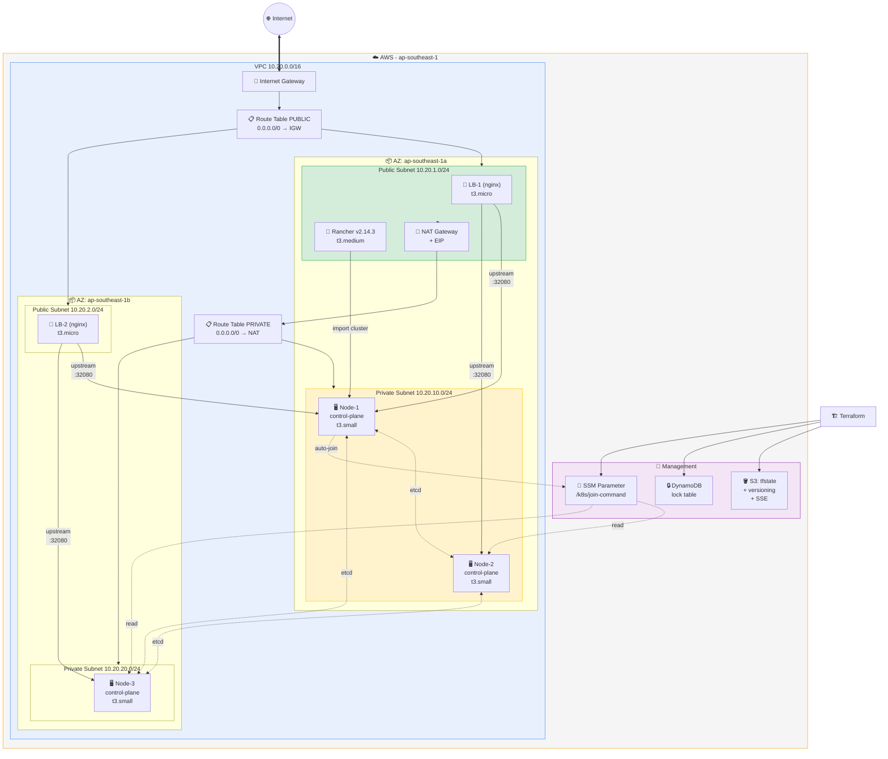

# TechShop Infrastructure — Terraform (AWS)

## Kiến trúc hạ tầng



| Tầng | Resource | AZ | Subnet | Mục đích |
|---|---|---|---|---|
| **Public** | LB-1 | a | 10.20.1.0/24 | Reverse proxy → K8s |
| **Public** | LB-2 | b | 10.20.2.0/24 | Reverse proxy → K8s |
| **Public** | Rancher | a | 10.20.1.0/24 | Quản lý cluster |
| **Public** | NAT Gateway | a | 10.20.1.0/24 | Internet cho private |
| **Private** | Node-1, Node-2 | a | 10.20.10.0/24 | HA control-plane |
| **Private** | Node-3 | b | 10.20.20.0/24 | HA control-plane |
| **Backend** | S3 + DynamoDB | — | — | Terraform state |
```

## Cấu trúc thư mục

```
terraform/
├── modules/                    # Module tái sử dụng
│   ├── network/                # VPC, subnets, NAT, IGW, SG
│   ├── compute/                # EC2 K8s + IAM SSM + auto-join
│   ├── loadbalancer/           # 2 nginx reverse proxy
│   ├── rancher/                # Rancher server
│   └── state-backend/          # S3 bucket + DynamoDB lock
├── envs/                       # Folder-based environments
│   ├── dev/main.tf             # Dev config
│   └── stg/main.tf             # Staging config
└── live/                       # Workspace demo (Day 2)
    ├── main.tf                 # 1 file, multi-workspace
    ├── outputs.tf
    └── variables.tf
```

## Prerequisites

```bash
# AWS CLI + credentials
aws configure --profile default
aws sts get-caller-identity

# Terraform >= 1.5
terraform version

# SSH key (tạo 1 lần)
aws ec2 create-key-pair --region ap-southeast-1 \
  --key-name techshop-key --query 'KeyMaterial' --output text > ~/.ssh/techshop-key.pem
chmod 400 ~/.ssh/techshop-key.pem

# SSM plugin (SSH không cần public IP)
curl "https://s3.amazonaws.com/session-manager-downloads/plugin/latest/ubuntu_64bit/session-manager-plugin.deb" -o /tmp/ssm.deb
sudo dpkg -i /tmp/ssm.deb
```

## Deploy — Folder-based (Lab chính)

### Dev environment

```bash
cd terraform/envs/dev

# Init + apply (local backend → tạo S3 bucket)
terraform init
terraform apply -auto-approve

# Migrate lên S3 backend (sửa backend "local" → backend "s3")
sed -i 's/backend "local"/backend "s3"/' main.tf
terraform init -migrate-state

# Lấy IP node-1
NODE1=$(aws ec2 describe-instances --region ap-southeast-1 \
  --filters "Name=tag:Name,Values=techshop-k8s-node-1" \
  --query 'Reservations[0].Instances[0].InstanceId' --output text)

# SSH vào node-1 qua SSM
ssh -i ~/.ssh/techshop-key.pem \
  -o "ProxyCommand=aws ssm start-session --region ap-southeast-1 --target $NODE1 --document-name AWS-StartSSHSession" \
  ubuntu@$NODE1

# Check cluster
sudo KUBECONFIG=/etc/kubernetes/admin.conf kubectl get nodes

# Destroy khi không dùng
terraform destroy -auto-approve
```

### Staging environment

```bash
cd terraform/envs/stg

# Tạo S3 bucket trước
aws s3api create-bucket --bucket techshop-tfstate-stg --region ap-southeast-1 \
  --create-bucket-configuration LocationConstraint=ap-southeast-1
aws s3api put-bucket-versioning --bucket techshop-tfstate-stg \
  --versioning-configuration Status=Enabled

# Init + apply
terraform init
terraform apply -auto-approve
```

## Deploy — Workspace (Day 2 demo)

```bash
cd terraform/live

# Tạo S3 bucket shared
aws s3api create-bucket --bucket techshop-tfstate --region ap-southeast-1 \
  --create-bucket-configuration LocationConstraint=ap-southeast-1
aws s3api put-bucket-versioning --bucket techshop-tfstate \
  --versioning-configuration Status=Enabled

# Init + tạo workspaces
terraform init
terraform workspace new dev
terraform workspace new stg

# Deploy dev
terraform workspace select dev
terraform apply -auto-approve

# Switch sang stg (dùng chung code, state riêng)
terraform workspace select stg
terraform apply -auto-approve

# Xem outputs
terraform output

# Dependency graph
terraform graph | dot -Tsvg > /tmp/deps.svg

# Destroy
terraform destroy -auto-approve
```

## K8s Cluster Info

| Thành phần | Chi tiết |
|---|---|
| Version | v1.35.6 |
| CNI | Calico v3.28.0 |
| Runtime | containerd v2.2.1 |
| Control plane | 3 nodes HA (stacked etcd) |
| Pod CIDR | 10.244.0.0/16 |
| Access | SSM Session Manager (không public IP) |

## Notes

- K8s nodes tự động join cluster qua SSM Parameter Store `/k8s/join-command`
- Script chờ NAT Gateway sẵn sàng trước khi cài packages
- Không cần SSH thủ công — `terraform apply` là lên tất cả
- Rancher tại `https://<rancher-public-ip>:8443` (bỏ qua warning SSL)
- LB port 32080 → app NodePort (cần deploy app để thấy nội dung)
