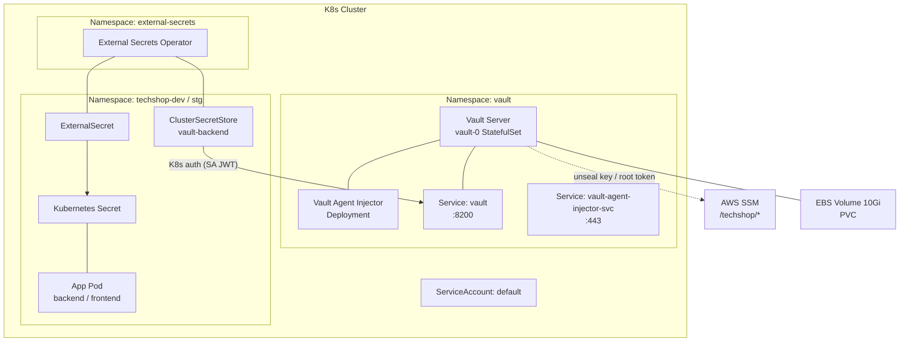
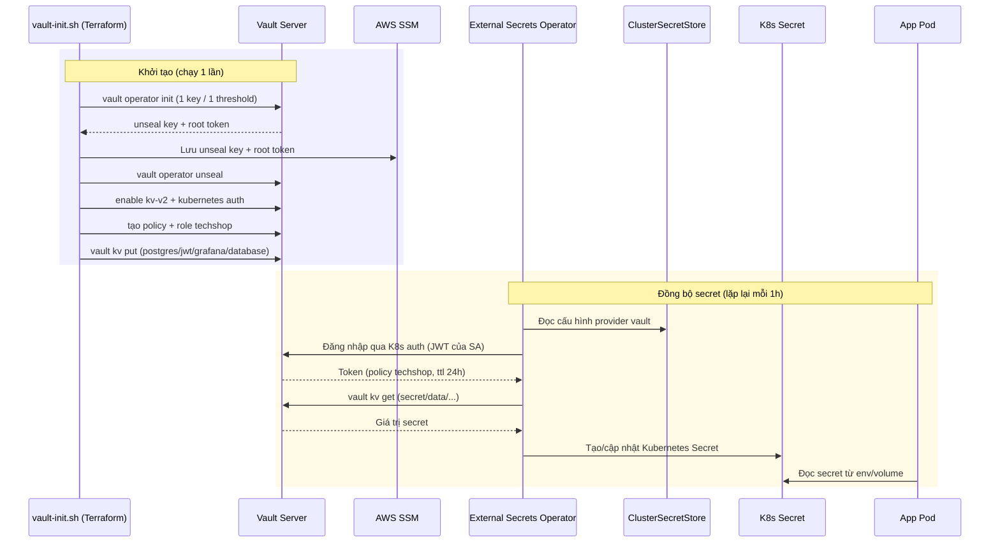

# Báo cáo chi tiết: Hệ thống HashiCorp Vault trong TechShop

> Phạm vi: Kiến trúc Vault trên Kubernetes, các thành phần, cách sử dụng & giao tiếp.
> Trạng thái: ✅ Đã triển khai & hoạt động (verified 2026-07-31).

---

## 1. Tổng quan kiến trúc



**Tóm tắt:** Vault chạy **in-cluster** (standalone, 1 pod) lưu data trên **EBS volume**. Secret được tạo trong Vault (KV v2) → **External Secrets Operator (ESO)** xác thực bằng **Kubernetes auth** → đồng bộ thành **K8s Secret** bình thường → app pod đọc như secret thường. Unseal key & root token được backup vào **AWS SSM** để phục hồi.

---

## 2. Các thành phần & tình trạng trong project

| # | Thành phần | Có trong project? | Chi tiết |
|---|---|---|---|
| 1 | Vault Server (StatefulSet) | ✅ | `vault-0`, 1 replica, standalone mode |
| 2 | Vault Agent Injector | ✅ | `vault-agent-injector-*` (deployed, chưa dùng cho app) |
| 3 | Storage (EBS + StorageClass) | ✅ | PVC 10Gi, StorageClass `techshop-ssm-waitforfirstconsumer` |
| 4 | Secret Engine KV v2 | ✅ | path = `secret` |
| 5 | Auth Method Kubernetes | ✅ | mount = `kubernetes`, role = `techshop` |
| 6 | Policy | ✅ | policy `techshop` (read 4 paths) |
| 7 | Unseal key / Root token backup | ✅ | AWS SSM `/techshop/*` |
| 8 | External Secrets Operator | ✅ | ClusterSecretStore + ExternalSecret |
| 9 | Vault Agent sidecar injection | ⚠️ | Injector có sẵn nhưng app dùng ESO, không dùng agent sidecar |
| 10 | Dynamic secrets (DB creds xoay vòng) | ❌ | Chưa — dùng KV static secrets |
| 11 | Vault HA / Auto-unseal (KMS) | ❌ | Standalone + thủ công unseal bằng key trong SSM |

---

## 3. Từng thành phần chi tiết

### 3.1 Vault Server — `vault-0` (StatefulSet)

**Cần gì:**
- Helm chart `hashicorp/vault` (repository `https://helm.releases.hashicorp.com`)
- Storage: PVC `10Gi` dùng StorageClass `techshop-ssm-waitforfirstconsumer` (provisioner `ebs.csi.aws.com`, `WaitForFirstConsumer`)
- 1 pod đủ dùng (dev), namespace `vault`
- Cấu hình trong `terraform/live/main.tf` → `helm_release.vault`

**Vai trò:** Là nơi lưu trữ tập trung toàn bộ secret (password, JWT, DB URL...).

**Giao tiếp:** Lắng nghe:
- Port `8200` (HTTP API) — qua Service `vault` (ClusterIP)
- Port `8201` (cluster internal) — qua Service `vault-internal`

```bash
# Kiểm tra trạng thái
kubectl exec -n vault vault-0 -- vault status
```

### 3.2 Storage — EBS Volume

**Cần gì:**
- EBS CSI Driver (`helm_release.ebs_csi_driver`, namespace `kube-system`)
- StorageClass `techshop-ssm-waitforfirstconsumer`: `volumeBindingMode: WaitForFirstConsumer`, `type: gp3`, `encrypted: true`
- PVC tự tạo bởi StatefulSet (data-vault-0)

**Vai trò:** Lưu file storage của Vault — **secret vẫn còn sau khi pod restart**.

### 3.3 Secret Engine — KV v2

**Cần gì:** Vault server + root token (một lần khi init).

**Vai trò:** Nơi chứa secret dạng key-value (versioned).

**Các secret đang có (path `secret/`):**

| Path | Keys | Dùng cho |
|---|---|---|
| `secret/data/postgres` | `password` | Postgres |
| `secret/data/jwt` | `secret` | JWT signing |
| `secret/data/grafana` | `admin_password` | Grafana |
| `secret/data/database` | `url` | DATABASE_URL của backend |

**Cách dùng (thủ công):**
```bash
kubectl exec -n vault vault-0 -- env VAULT_TOKEN="<root-token>" \
  vault kv get secret/postgres          # đọc
kubectl exec -n vault vault-0 -- env VAULT_TOKEN="<root-token>" \
  vault kv put secret/postgres password="abc"   # ghi
```

### 3.4 Auth Method — Kubernetes

**Cần gì:**
- ServiceAccount token + CA của pod Vault (tự động có trong pod)
- API server address (biến `KUBERNETES_PORT_443_TCP_ADDR`)
- `vault auth enable kubernetes`

**Vai trò:** Cho phép các pod trong cluster xác thực vào Vault **bằng ServiceAccount** mà không cần token tĩnh — an toàn hơn, tự xoay vòng.

**Cấu hình (từ vault-init.sh bước 8):**
```bash
vault write auth/kubernetes/config \
  token_reviewer_jwt="$SA_JWT" \
  kubernetes_host="https://$K8S_HOST:443" \
  kubernetes_ca_cert="$SA_CA"
```

### 3.5 Policy + Role — `techshop`

**Cần gì:** Vault root token khi tạo.

**Policy `techshop`** — chỉ đọc đúng 4 path cần thiết (nguyên tắc least-privilege):
```hcl
path "secret/data/postgres" { capabilities = ["read"] }
path "secret/data/jwt"      { capabilities = ["read"] }
path "secret/data/grafana"  { capabilities = ["read"] }
path "secret/data/database" { capabilities = ["read"] }
```

**Role `techshop`** — ràng buộc xác thực:
- `bound_service_account_names="*"`
- `bound_service_account_namespaces="techshop-dev,techshop-stg"`
- `policies=techshop`
- `ttl=24h`

**Vai trò:** Kiểm soát **ai được đọc gì** khi xác thực qua K8s auth.

### 3.6 Unseal / Root token backup — AWS SSM

**Cần gì:** AWS CLI + region.

**Vai trò:** Vault sau khi init bị **sealed** (mã hoá) — cần unseal key để mở. Nếu mất key thì secret mất vĩnh viễn → backup vào SSM:

| SSM Parameter | Giá trị |
|---|---|
| `/techshop/vault-unseal-key` | Unseal key (SecureString) |
| `/techshop/vault-root-token` | Root token (SecureString) |
| `/techshop/postgres-password`, `/techshop/jwt-secret`, `/techshop/grafana-password`, `/techshop/database-url` | Secret dự phòng |

**Cách unseal khi pod restart / cluster mới:**
```bash
KEY=$(aws ssm get-parameter --name /techshop/vault-unseal-key --with-decryption --query Parameter.Value --output text)
kubectl exec -n vault vault-0 -- vault operator unseal "$KEY"
```
> `vault-init.sh` tự động làm việc này khi chạy lại (detect sealed → đọc key từ SSM → unseal).

### 3.7 External Secrets Operator (ESO)

**Cần gì:**
- Helm release `external-secrets` (namespace `external-secrets`)
- `ClusterSecretStore` trỏ tới Vault
- `ExternalSecret` khai báo map secret

**Vai trò:** Cầu nối **Vault → Kubernetes Secret** tự động. App không cần biết Vault — chỉ đọc K8s Secret bình thường.

**Cấu hình ClusterSecretStore (`vault-backend`):**
```yaml
apiVersion: external-secrets.io/v1
kind: ClusterSecretStore
metadata:
  name: vault-backend
spec:
  provider:
    vault:
      server: "http://vault.vault.svc.cluster.local:8200"
      path: "secret"
      version: "v2"
      auth:
        kubernetes:
          mountPath: "kubernetes"
          role: "techshop"
          serviceAccountRef:
            name: "default"
            namespace: "techshop-dev"
```

**Các ExternalSecret đang chạy (tạo ra K8s Secret):**

| ExternalSecret | K8s Secret tạo ra | Keys |
|---|---|---|
| `backend-secrets` | `backend-secrets` | `DATABASE_URL`, `JWT_SECRET` |
| `postgres-credentials` | `postgres-credentials` | `password` |
| `grafana-admin` | `grafana-admin` | `admin_password` |

**Refresh:** mỗi `1h` (refreshInterval) — khi đổi secret trong Vault, K8s Secret tự cập nhật.

---

## 4. Luồng giao tiếp end-to-end



---

## 5. So sánh với task (những gì đủ / thiếu)

**Đã có đầy đủ (so với task HashiCorp Vault cơ bản):**
- ✅ Vault Server standalone + storage bền (EBS)
- ✅ Secret Engine KV v2
- ✅ Kubernetes Auth + Policy + Role (least-privilege)
- ✅ Backup unseal key (AWS SSM)
- ✅ Tích hợp ESO → app đọc secret tự động

**Chưa có / có thể mở rộng (nếu task yêu cầu nâng cao):**
- ❌ **Dynamic Database Secrets** — hiện dùng static password, chưa xoay vòng tự động (postgres user/pass cố định)
- ❌ **Auto-unseal bằng AWS KMS** — hiện unseal thủ công bằng key trong SSM
- ❌ **HA mode** — hiện standalone 1 pod, chưa raft cluster nhiều node
- ❌ **Vault Agent sidecar** cho app — Injector đã deploy nhưng app dùng ESO thay vì agent injection

---

## 6. Vận hành — các lệnh quan trọng

```bash
# Trạng thái Vault
kubectl exec -n vault vault-0 -- vault status

# Đọc secret (cần root token từ SSM)
TOKEN=$(aws ssm get-parameter --name /techshop/vault-root-token --with-decryption --query Parameter.Value --output text)
kubectl exec -n vault vault-0 -- env VAULT_TOKEN="$TOKEN" vault kv get secret/postgres

# Xem K8s Secret đã sync (dữ liệu đang base64)
kubectl get secret -n techshop-dev backend-secrets -o jsonpath='{.data.DATABASE_URL}' | base64 -d

# List ExternalSecret
kubectl get externalsecret -n techshop-dev

# Trạng thái ExternalSecret (xem có lỗi sync không)
kubectl get externalsecret -n techshop-dev -o wide
```

---

## 7. Tóm tắt cấu hình chính (nơi khai báo)

| Thành phần | File cấu hình |
|---|---|
| Vault Helm release | `terraform/live/main.tf` (`helm_release.vault`) |
| StorageClass + EBS CSI | `terraform/live/main.tf` |
| Init & secrets | `terraform/live/vault-init.sh` |
| ClusterSecretStore + ExternalSecret | `terraform/live/manifests/00-cluster-secret-store.yaml`, `01-external-secrets.yaml` |
| ExternalSecret (theo env) | `helm/techshop/templates/external-secrets.yaml` |
| External Secrets Operator | `terraform/live/main.tf` (`helm_release.external_secrets`) |

---

# Báo cáo bổ sung — Vault nâng cao (2026-07-31)

## A. Vault Agent Sidecar ✅ ĐÃ TEST THÀNH CÔNG

**Mục đích:** Inject container `vault-agent` vào pod app để tự lấy secret từ Vault render thành file.

**Cách hoạt động:**
- Injector (`vault-agent-injector`, namespace `vault`) đã chạy sẵn
- Thêm annotation vào deployment → injector tự chèn init container `vault-agent-init` + container `vault-agent`
- Vault agent đăng nhập bằng K8s auth (role `techshop`) → render secret ra file `/vault/secrets/<name>`

**Annotation dùng để test:**
```yaml
annotations:
  vault.hashicorp.com/agent-inject: "true"
  vault.hashicorp.com/role: "techshop"
  vault.hashicorp.com/agent-inject-secret-database: "secret/data/database"
```

**Kết quả test (pod `vault-agent-test` trong techshop-dev):**
- ✅ Pod 2/2 Running (app + vault-agent), init container `vault-agent-init`
- ✅ File `/vault/secrets/database` chứa secret lấy từ Vault (gồm `url` = DATABASE_URL)
- ✅ Xác thực thành công qua role `techshop` (K8s auth)

## B. Dynamic Database Secrets ✅ ĐÃ TEST THÀNH CÔNG

**Mục đích:** Vault tự sinh credential tạm thời (có TTL) để kết nối Postgres thay vì static password.

**Các bước cấu hình (đã thêm vào `vault-init.sh`):**
1. `vault secrets enable database`
2. `vault write database/config/techshop-postgres` — connection tới Postgres (superuser)
3. `vault write database/roles/techshop-role` — role sinh credential, TTL 1h / max 24h

**Vấn đề gặp phải & fix:**
- Vault không kết nối được Postgres → do **NetworkPolicy** `postgres-allow-backend` chỉ cho `backend` + `postgres-backup` gọi port 5432
- **Fix:** thêm `namespaceSelector` cho `vault` namespace trong `helm/techshop/templates/networkpolicy.yaml` (đã commit + push)

**Kết quả test:**
- ✅ Vault sinh credential động: user `v-root-techshop-*`, password random, lease 1h
- ✅ User thực sự được tạo trên Postgres và login thành công: `SELECT current_user` trả về `v-root-techshop-...` trên DB `shopdb`

**Role creation statements (Postgres):**
```sql
CREATE ROLE "{{name}}" WITH LOGIN PASSWORD '{{password}}' VALID UNTIL '{{expiration}}';
GRANT CONNECT ON DATABASE shopdb TO "{{name}}";
GRANT SELECT, INSERT, UPDATE, DELETE ON ALL TABLES IN SCHEMA public TO "{{name}}";
```

## C. Auto-unseal AWS KMS ⚠️ ĐÃ CẤU HÌNH, CHƯA TEST XONG

**Mục đích:** Vault tự mở khoá khi khởi động bằng AWS KMS thay vì unseal thủ công.

**Đã thực hiện:**
1. ✅ Tạo KMS key: `5f9e342a-d45d-4a93-9841-0398fe67b7da` (alias `alias/vault-unseal`)
2. ✅ Thêm IAM permissions `kms:Encrypt/Decrypt/DescribeKey/GenerateDataKey` vào node role (`terraform/modules/compute/main.tf`) — đã apply `-target` (không phá instance)
3. ✅ Thêm `seal "awskms"` vào Helm values của Vault (`terraform/live/main.tf`):
```hcl
seal "awskms" {
  region     = "ap-southeast-1"
  kms_key_id = "5f9e342a-d45d-4a93-9841-0398fe67b7da"
}
```
4. ⚠️ **Chưa test xong** vì: đổi seal **bắt buộc re-init Vault** (xoá PVC data → chạy lại `vault-init.sh`). Trong lúc thực hiện phát hiện **cluster bị down** (xem mục D).

**Lưu ý quan trọng:** seal được chọn lúc `vault operator init`. Vault đã init bằng seal cũ (shamir) → muốn chuyển sang KMS seal phải **xoá PVC `data-vault-0` + re-init**. `vault-init.sh` tự tạo lại toàn bộ secret (kể cả database engine ở mục B).

## D. Sự cố: Cluster bị down (2026-07-31)

**Hiện tượng:** `kubectl` mất kết nối API server; `kubectl get pods` báo `dial tcp 18.143.187.20:6443: i/o timeout`.

**Chẩn đoán:**
- Master `techshop-k8s-node-1` bị **stop/start** → đổi public IP từ `18.143.187.20` → `47.128.228.65`
- Kubeconfig (local + SSM) vẫn trỏ IP cũ `18.143.187.20`
- **Kubelet bị disabled** → không tự start khi boot → control plane (apiserver/etcd) không chạy
- `/etc/kubernetes/manifests/` trên master **trống** → static pods không tồn tại
- **Terraform state không khớp:** thiếu hẳn `node[0]`; `node[1]` state (`i-087b807e0394765c4`) ≠ instance đang chạy (`i-019dc8f84b38cdfe9`)

**Kết luận:** Các node bị replace, state terraform không nhất quán, cluster không phục hồi được bằng cách nhẹ → **quyết định destroy + apply lại toàn bộ** (đã chứng minh hoạt động ổn định ở chu kỳ trước).
